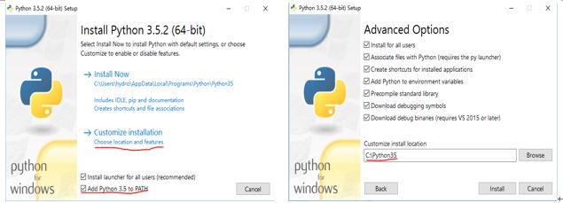

# Python学习和开发环境的建立

操作系统： Windows10  64位, 计算机联网


##  Windows10(64)

* Southeast University

* January 2015, Southeast University and Microsoft Corp provide legitimate Windows, Office for the staffs and students.

  http://nic.seu.edu.cn/2015/0113/c12333a115289/page.htm
  
 * Microsoft Corp
  
   * https://www.microsoft.com/en-gb/software-download/windows10
     * Do you want to install Windows 10 on your PC?
       
       download and run the media creation tool: http://go.microsoft.com/fwlink/?LinkId=691209
 
## 1 安装Python3.5
    
* 从Python官网下载Windows 64位Python3.5.2：  https://www.python.org/downloads/

  * 定制方式安装: 
      
      1) 安装软件到目录： C:\python35
            
      2) 勾选“Add Python3.5 to Path” 


   
* 更新pip到新版本:DOS命令行下
```bash
  >python -m pip install -U pip
```

## 2 安装Jupyter Notebook

* 安装：命令行

```bash       
    >pip install jupyter
```      

* 启动Jupyter notebook： 命令行

```bash       
    >jupyter notebook     
```
## 3 科学计算包 
   
        scipy
        numpy
        matplotlib

从  http://www.lfd.uci.edu/~gohlke/pythonlibs/ 下载Windows64位包, 然后,pip命令安装（*指下载的软件包名）

```bash       
   > pip install *.whl
```       

## 4 IF97物性计算
    
*  从github下载课程SEUIF97仓库zip文件：https://github.com/PySEE/SEUIF97 


   
*  解压下载的zip文件，然后：
   
        1)将libseuif97.dll拷贝到 c:\windows\system
        2)将seuif97.py拷贝到python安装目录的lib子目录下，如C:\python35\Lib
    
* Python版IF97

预先安装好numpy和scipy

```bash       
   > pip install iapws
``` 

## 5 课件

* 从github下载课程home仓库zip文件: https://github.com/PySEE/home


* 启动课程Jupyter Notebook

解压下载的 zip 文件,运行notebook子目录下的批处理文件: **StartNB.bat** ，启动课程Jupyter Notebook服务

## 6 设定Jupyter Notebook工作目录和快速启动Jupyter Notebook

* 指定某个文件夹为自己的Jupyter Notebook工作目录，在该文件夹下启动Jupyter Notebook服务，存放用Jupyter Notebook建立的项目。

* 快速启动Jupyter Notebook：

    在指定的Jupyter Notebook工作文件夹中，新建一空白文本文档，输入内容"jupyter notebook"

    将文本文件另存，文件名自定义，但必须加上".bat"后缀，如"start.bat"，文件类型选择""所有文件"

    双击"start.bat"文件，启动Jupyter Notebook 
