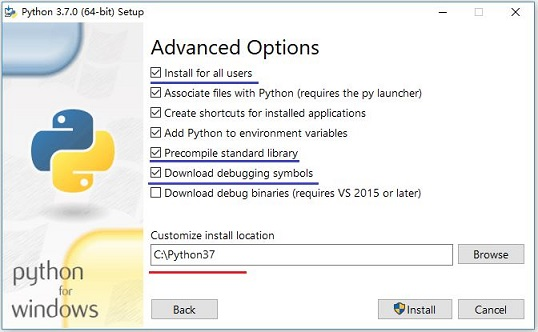
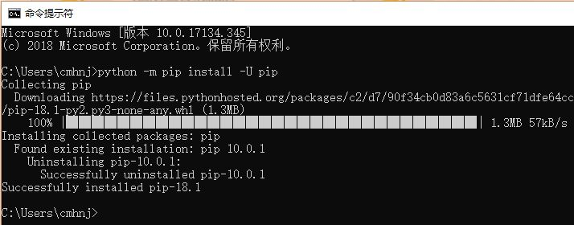
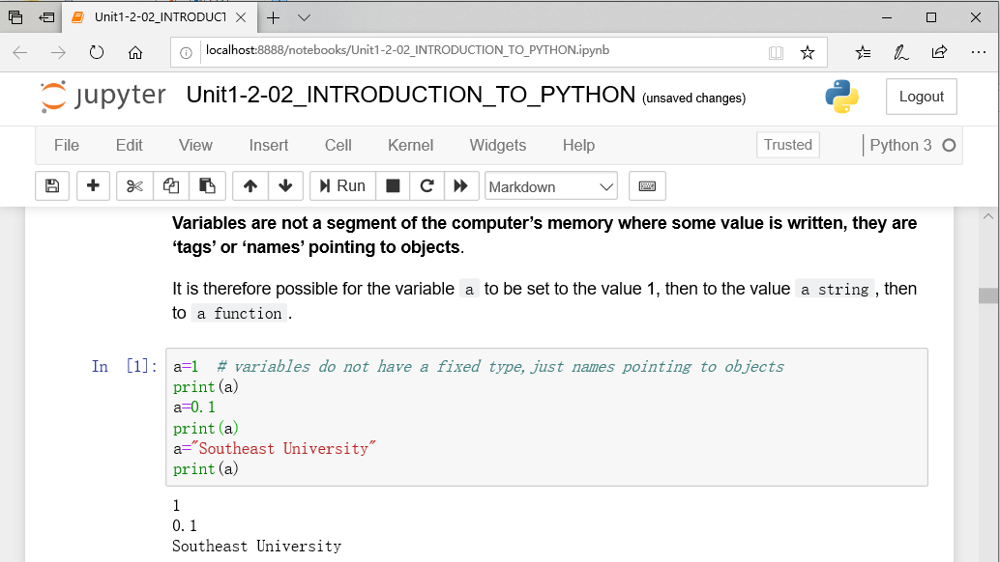
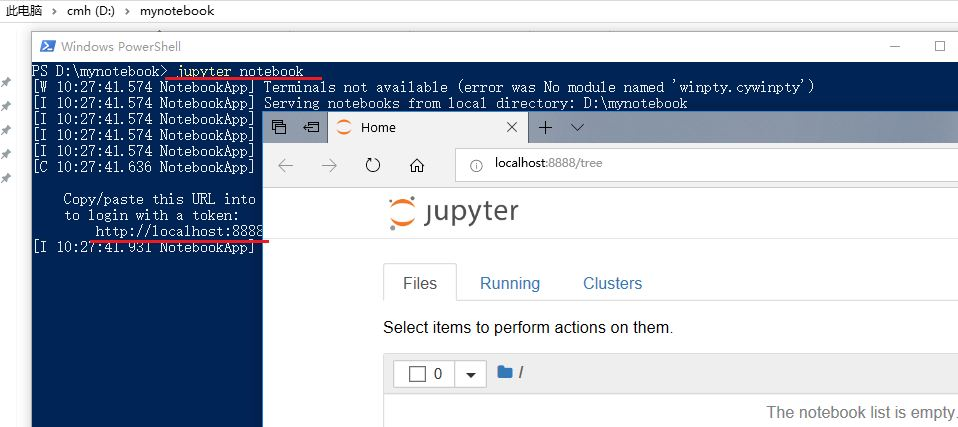
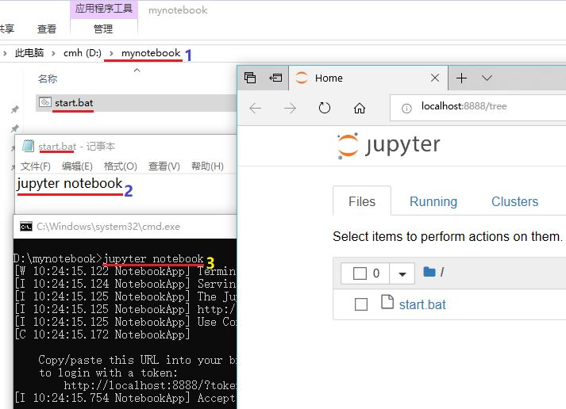
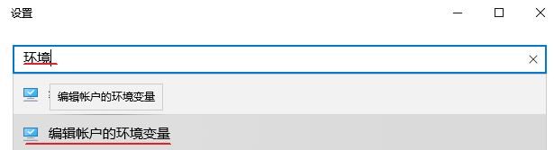

# The Guide of  Building Software Environment

Firstly，You **MUST** [setup the working directory for the course](./AdvWorkingDir.md)
<!-- TOC -->

- [The Guide of  Building Software Environment](#the-guide-of--building-software-environment)
    - [A:Python & PyPI](#apython--pypi)
        - [A.1 Customize Installation Python](#a1-customize-installation-python)
        - [A.2 The Python Package Index(PyPI)](#a2-the-python-package-indexpypi)
        - [A.3 Install Packages](#a3-install-packages)
            - [A.3.1 update `pip` to the most recent version](#a31-update-pip-to-the-most-recent-version)
            - [A.3.2 set `tsinghua` as default site](#a32-set-tsinghua-as-default-site)
            - [A.3.3 Install autopep8, pylint](#a33-install-autopep8-pylint)
    - [B:Jupyter Notebook](#bjupyter-notebook)
        - [B.1 Install & Start-up Jupyter Notebook](#b1-install--start-up-jupyter-notebook)
        - [B.2 Literate programming your Jupyter Notebook in the `specific working folder`](#b2-literate-programming-your-jupyter-notebook-in-the-specific-working-folder)
        - [B.3 Using the Jupyter Notebook of PySEE/home](#b3-using-the-jupyter-notebook-of-pyseehome)
    - [C:Install MinGW-W64](#cinstall-mingw-w64)
        - [C.1 Download MinGW-W64](#c1-download-mingw-w64)
    - [D:Visual Studio Code](#dvisual-studio-code)
        - [D.1 Download and Install Visual Studio Code](#d1-download-and-install-visual-studio-code)
        - [D.2 Install Extension: Python,C/C++](#d2-install-extension-pythoncc)
        - [D.3 Using Visual Studio Code: Python,C/C++](#d3-using-visual-studio-code-pythoncc)
    - [E: Using Git](#e-using-git)
        - [E.1 Install Git for Windows](#e1-install-git-for-windows)
        - [E.2 Clone & Update the PySEE/home](#e2-clone--update-the-pyseehome)
    - [F:Scientific Computation Packages](#fscientific-computation-packages)
        - [F.1 Scipy](#f1-scipy)
        - [F.2 IAPWS-IF97 Packages:](#f2-iapws-if97-packages)
            - [F.2.1 iapws](#f21-iapws)
            - [F.2.2 SEUIF97](#f22-seuif97)
    - [Extended](#extended)
        - [Windows10](#windows10)
        - [SEUIF97 Shared Library](#seuif97-shared-library)
        - [Install Python Packages: Third Parties,Requirements](#install-python-packages-third-partiesrequirements)
        - [Open Jupyter Notebooks within Visual Studio Code](#open-jupyter-notebooks-within-visual-studio-code)
    - [References](#references)

<!-- /TOC -->

## A:Python & PyPI

Goto [the official Python site](https://www.python.org/downloads/), you can use typically **Download the latest version of Python** `button` that appears first on the page to get the latest version of Python.

You may choose the specific Python release for you, e.g. [**Python for Windows**](https://www.python.org/downloads/windows/)

### A.1 Customize Installation Python

In the example ,we use [Python 3.7.0 for Windows x86-64](https://www.python.org/ftp/python/3.7.0/python-3.7.0-amd64.exe)  

* 1  Make sure you **check** option **Add Python 3.7 to PATH**

* 2  To change install location, click on **Customize installation** , then **Next** and enter **C:\python37** the item of  **Customize installation location**



   
* 3 Using IDLE


### A.2 The Python Package Index(PyPI)

The Python Package Index(PyPI) is a repository of software for the Python programming language.: https://pypi.org/

`pip` is a package manage for Python. It makes installing and uninstalling Python packages

* Installing Python Modules : https://docs.python.org/3/installing/

**A.2.1 Install** 

The following command will install the latest version of a module and its dependencies from the Python Packaging Index:

```bash
>python -m pip install SomePackage  
```

Install the  multiple modules at the one `pip install` command

```bash
>python -m pip install SomePackage1  SomePackage2 
```

**A.2.2 Upgrading**
Normally, if a suitable module is already installed, attempting to install it again will have no effect. Upgrading existing modules must be requested **explicitly**:

```bash
>python -m pip install --upgrade SomePackage  
```
or

```bash
>python -m pip install -U SomePackage  
```

**A.2.3 Install from an alternate index**

```bash
>python -m pip install SomePackage  -i  the-url-of-an-alternate-index
``` 

Install from `@tsinghua` for the **higher speed**: https://pypi.tuna.tsinghua.edu.cn/simple 

```bash
>pip  install packagename  -i  https://pypi.tuna.tsinghua.edu.cn/simple
```

**A.2.4 set one alternate index site as the default site**

* if pip>10.0

```bash
>pip config set global.index-url https://pypi.tuna.tsinghua.edu.cn/simple
```

**A.2.5 uninstall**  

```bash
>pip uninstall packagename  
```

**A.2.6 Show help for commands**

```bash
>pip  help  
```

### A.3 Install Packages

#### A.3.1 update `pip` to the most recent version

```bash
>python -m pip install -U pip -i  https://pypi.tuna.tsinghua.edu.cn/simple
```



#### A.3.2 set `tsinghua` as default site 

```bash
>pip config set global.index-url https://pypi.tuna.tsinghua.edu.cn/simple
```

#### A.3.3 Install autopep8, pylint

```bash  
>python -m pip install autopep8 
>python -m pip install pylint
```

or

```bash  
>python -m pip install autopep8 pylint
```

## B:Jupyter Notebook

The Jupyter Notebook is an open-source web application that allows you to create and share documents that contain live code, equations, visualizations and narrative text.



### B.1 Install & Start-up Jupyter Notebook

To install Jupyter,run the following command in a terminal:

```bash   
>python -m pip install jupyter
```

To start up Jupyter, run the following command in a terminal:

```bash   
>jupyter notebook
```

### B.2 Literate programming your Jupyter Notebook in the `specific working folder`

* `B.2.1` make **the specific folder** for  your Jupyter Notebook,for example: `D:/mynotebook`

* `B.2.2` **Open a cmd window in the folder**:  If you're already in the folder you want, you do `Shift+[mouse right-click]` on the background of the Explorer window, then click on `"Open command window here"` or `"Open PowerShell window here"`

* `B.2.3` Enter `jupyter notebook` in cmd window of the folder,you will see the active jupyter server. the folder is the default  folder of your Jupyter Notebook 

   Jupyter will automatically open up in your default web browser

    

* `B.2.4`  start **Jupyter Notebook** quickly 

   * `1` make the **"start.bat"** batch file with the content **`jupyter notebook`** through Windows's **notepad.exe**(记录本)  in the working folder of your Jupyter Notebook

   * `2` Double-click **`start.bat`**，the **Jupyter Notebook**  server will start 

  

* `B.2.5 ` To create a new notebook 

  To create a new notebook, click the `New` button and select the `“Python 3”` option. You should see something like the follow Figure. If this is your first time, try clicking on the empty code `“cell”` and entering a line of Python code. Then press `Shift-Enter` to execute it.

 
  
  You may click  `File`->`Save As...` to save the notebook file as a given name with the extension `.ipynb`.

### B.3 Using the Jupyter Notebook of PySEE/home

pre-installed:Python3 and Jupyter Notebook

**B.3.1**  Download the zip file

Go to the repo **home** on the Github: https://github.com/PySEE/home ,then download `home.zip` to your computer


**B.3.2** Open the notebooks in Jupyter Notebook

 unzip `home.zip`, double-click  `StartNB.bat`(OS:Windows)  in the sub-folder of **notebook** of `home`. This will open a web page in your browser with a list of the available notebooks.

## C:Install MinGW-W64

### C.1 Download MinGW-W64

Goto [MinGW-W64](https://sourceforge.net/projects/mingw-w64/files/?source=navbar) site, you see that：

**MinGW-W64 GCC-?.?.?**

```bash 
x86_64-posix-sjlj
x86_64-posix-seh
x86_64-win32-sjlj
x86_64-win32-seh 
```

* posix: enable C++11/C11 multithreading features

* win32 using the win32 API multithreading features 

* sjlj: 32 and 64 bits,but it incurs a minor performance penalty
 
* seh：64 bits only
  
Download the latest available version of gcc compiler for **windows32/64** with **posix thread**：GCC-8.1.0 [x86_64-posix-sjlj](https://sourceforge.net/projects/mingw-w64/files/Toolchains%20targetting%20Win64/Personal%20Builds/mingw-builds/8.1.0/threads-posix/sjlj/x86_64-8.1.0-release-posix-sjlj-rt_v6-rev0.7z)

> [POSIX](https://en.wikipedia.org/wiki/POSIX): The Portable Operating System Interface is a family of standards specified by the IEEE Computer Society for maintaining `compatibility between operating systems`. POSIX defines the application programming interface (API), along with command line shells and utility interfaces, for software compatibility with variants of `Unix and other operating systems`.

> [Thread](https://en.wikipedia.org/wiki/Thread_(computing)) In computer science, a thread of execution is the smallest sequence of programmed instructions that can be managed `independently by a scheduler`, which is typically a part of the operating system. The implementation of threads and processes differs between operating systems, but in most cases `a thread is a component of a process`. Multiple threads can exist within one process, executing `concurrently` and `sharing resources` such as memory, while different processes do not share these resources. In particular, the threads of a process share its executable code and the values of its dynamically allocated variables and non-thread-local global variables at any given time. 
  
 ### C.2 Set MinGW-w64 Environment

**C.2.1** unzip the zipped MinGW-w64,then,remove to **C:\mingw64**

**C.2.2** Add **C:\mingw64\bin** to the system environment variable **Path**

   For Windows 10: 

   Start  "Windows Start Menu" ⇒ Open "Settings" ⇒ Search for "environment" ⇒ Select "Edit System environment variables".

  
 
   Choose "Environment Variables" ⇒  Go to the section  "**System Variable**" ⇒ Choose the "**Path**" ⇒ Choose "**New**" (add a new folder to  the **Path** variable) > Enter the value: **C:\mingw64\bin**

   

**C.2.3** RENAME `C:\mingw64\bin\mingw32-make.exe` to  `C:\mingw64\bin\make.exe`

**C.2.4** Verify the GCC installation by listing the version of gcc:
```bash
> gcc --version
```

## D:Visual Studio Code

Visual Studio Code is a lightweight but powerful source code editor which runs on your desktop and is available for Windows, macOS and Linux. It comes with built-in support for JavaScript, TypeScript and Node.js and has a rich ecosystem of extensions for other languages (such as C++, C#, Python, PHP, Go) and runtimes (such as .NET and Unity). 

### D.1 Download and Install Visual Studio Code 
 
Download  Visual Studio Code https://code.visualstudio.com/, then install

### D.2 Install Extension: Python,C/C++

* Python https://code.visualstudio.com/docs/languages/python

* C/C++ https://code.visualstudio.com/docs/languages/cpp

### D.3 Using Visual Studio Code: Python,C/C++

* Python 
---
* C/C++  

## E: Using Git

We **recommend** that you use [git](https://git-scm.com) to handle everything in the course: the repositories of PySEE,your projects,etc. 

### E.1 Install Git for Windows

Download Git for Windows: https://git-scm.com/download/win ,then install

### E.2 Clone & Update the PySEE/home 

After you have installed **git**, You may use the following **commands:**

**Clone the S2019 branch of the PySEE/home to your computer**

Cloning the S2019 branch of repository shallowly for saving bandwidth

```bash
>git clone --depth 1 -b S2019 https://github.com/PySEE/home.git
```

When you clone a repository you set up a copy on your computer. This will create a folder **home** on your computer with the files in sub-folders.

**Updating to The Latest Version**

As we release new files or  update files, you'll have to update your repository. You can do this by changing into the `home` directory and executing:

```bash
git pull
```

That's it - you'll have the latest version of the repository.


>you may also use any GUI git client to clone and update this repository, for example:  [Visual Studio Code](https://code.visualstudio.com/) ,or  [GitHub Desktop](https://desktop.github.com/)

## F:Scientific Computation Packages

### F.1 Scipy
   
   Numpy,Scipy, Matplotlib https://www.scipy.org/install.html 

```bash   
> python -m pip install numpy scipy matplotlib
``` 

### F.2 IAPWS-IF97 Packages: 

#### F.2.1 iapws

pre-installed:numpy and scipy

```bash   
> python -m pip install iapws 
``` 

#### F.2.2 SEUIF97

```bash   
> python -m pip install seuif97 
``` 

## Extended

### Windows10

64-bit Windows10 

**1 Southeast University**

January 2015, Southeast University and Microsoft Corp provide legitimate Windows, Office for the staffs and students.

  http://nic.seu.edu.cn/2015/0113/c12333a115289/page.htm
  
**2 Microsoft**
  
https://www.microsoft.com/en-gb/software-download/windows10

Do you want to install Windows 10 on your PC?
       
* download and run the media creation tool: 
       https://go.microsoft.com/fwlink/?LinkId=691209
 
### SEUIF97 Shared Library

Go to the repo on the Github：https://github.com/PySEE/SEUIF97 , download SEUIF97.zip


   
*  Unzip the downloaded file,then：
   
   * 1 copy **libseuif97.dll** to c:\windows\system
   * 2 copy **seuif97.py** to the **Lib** dir of installed Python. If you have install Python3.7 in the C:\Python37\, copy to `C:\python37\Lib`

### Install Python Packages: Third Parties,Requirements

* `1` Binary packages are also available from third parties. For Windows, Christoph Gohlke provides [Unofficial Windows Binaries for Python Extension Packages](https://www.lfd.uci.edu/~gohlke/pythonlibs/).

```bash 
>pip install *.whl
```

* `2` Requirements file [requirements.txt](./requirements.txt) is the file containing a list of items to be installed for the course:

```bash 
>python -m pip install -r requirements.txt 
```
### Open Jupyter Notebooks within Visual Studio Code  

* Install Visual Studio Code Tools for AI extension

https://github.com/Microsoft/vscode-tools-for-ai/blob/master/docs/installation.md

* Open Jupyter notebooks in VS Code
https://github.com/Microsoft/vscode-tools-for-ai/blob/master/docs/quickstart-06-jupyter.md

   * Set Python path properly in VS Code，for example: C:/python37/python.exe

   * Open Jupyter notebooks in VS Code

     Launch Visual Studio Code and select File > Open Folder (Ctrl+K Ctrl+O) Select a folder which contains the Jupyter notebook file (.pynb) you want to open.
    Select command in context menu Right click the Jupyter notebook file node and select "AI: View in Jupyter Server" command. 

## References

* 1 Python3:  https://www.python.org/downloads/
  
  * Guido van Rossum. Python Tutorial. https://docs.python.org/3/tutorial/index.html

* 2 Python Packages

  * Jupyter: http://jupyter.org/

  * Documentation. http://jupyter.readthedocs.org/en/latest/

  * Numpy、Scipy and Matplotlib http://www.scipy.org/ 

    * Scipy. http://www.scipy.org/

    * Numpy. http://www.numpy.org/
  
    * Matplotlib.  http://matplotlib.org/

  * IAPWS-IF97:

     * Shared Lib: https://github.com/PySEE/SEUIF97

     * Python: https://github.com/jjgomera/iapws
 
* 3 Visual Studio Code：https://code.visualstudio.com/

   * Documentation: https://code.visualstudio.com/docs

   * **Markdown** and VS Code： https://code.visualstudio.com/docs/languages/markdown

   * Getting Started with **Python** https://code.visualstudio.com/docs/python/python-tutorial

   * **C/C++** for VS Code： https://code.visualstudio.com/docs/languages/cpp
 
* 4 GCC, the GNU Compiler Collection：http://gcc.gnu.org/

     * MinGW-W64(GCC) Compiler Suite: GCC for Windows 64 & 32 bits：http://mingw-w64.org/

     * GCC and Make：Compiling, Linking and Building C/C++ Applications http://www3.ntu.edu.sg/home/ehchua/programming/cpp/gcc_make.html

* 5 Git

    * Git  https://git-scm.com

    * How to get started with GIT and work with GIT Remote Repo  http://www3.ntu.edu.sg/home/ehchua/programming/howto/Git_HowTo.html

    * Git Version Control in VS Code：https://code.visualstudio.com/docs/editor/versioncontrol

    * 知乎：怎样使用GitHub. http://www.zhihu.com/question/20070065