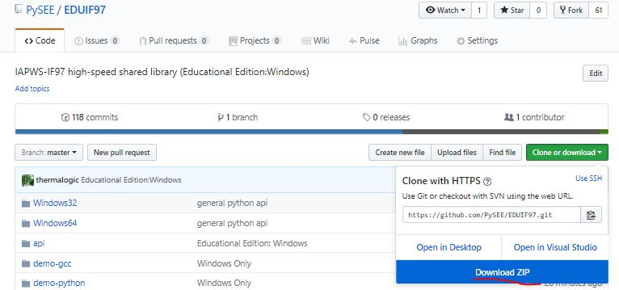
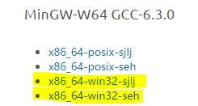
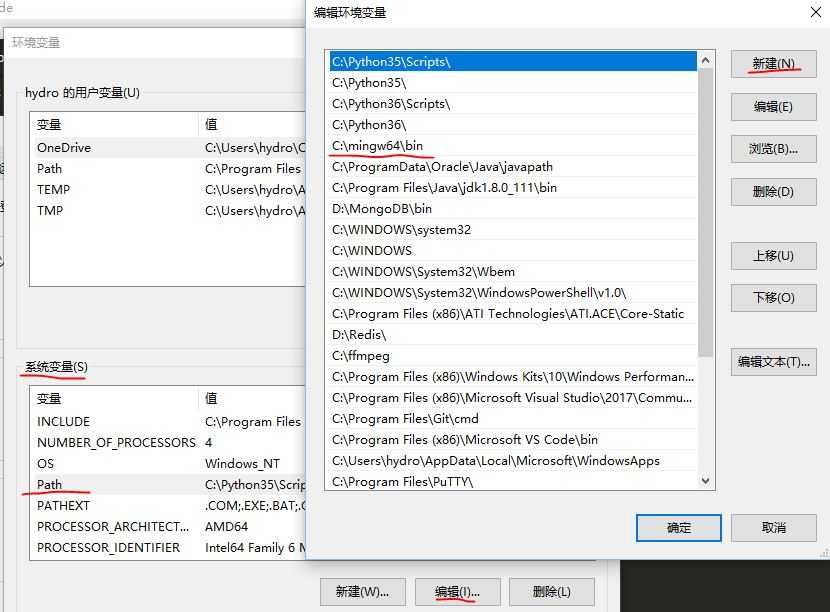
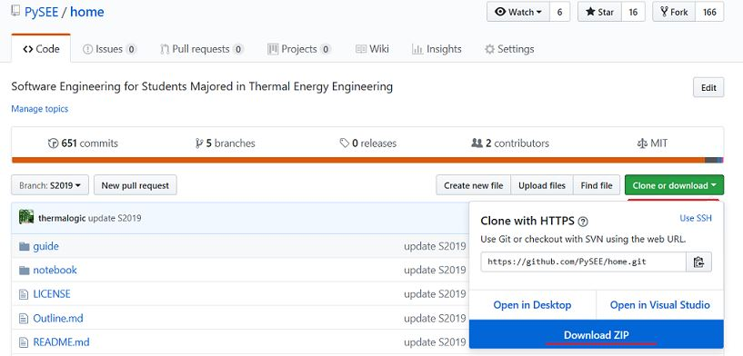

# Building Software Environment 

## A  Windows10：

  64-bit Windows10 

* 1 Southeast University

  * January 2015, Southeast University and Microsoft Corp provide legitimate Windows, Office for the staffs and students.

  http://nic.seu.edu.cn/2015/0113/c12333a115289/page.htm
  
* 2 Microsoft
  
   * https://www.microsoft.com/en-gb/software-download/windows10
     * Do you want to install Windows 10 on your PC?
       
       download and run the media creation tool: 
       https://go.microsoft.com/fwlink/?LinkId=691209
 
## B Development tools and packages

* 1 Python3:  https://www.python.org/downloads/

* 2 Python Packages

  * 2.1 Jupyter: http://jupyter.org/

  * 2.2 Numpy、Scipy and Matplotlib for Windows:  http://www.lfd.uci.edu/~gohlke/pythonlibs/ 

  * 2.3 IAPWS-IF97:

     * Shared Lib: https://github.com/PySEE/SEUIF97

     * Python: https://github.com/jjgomera/iapws
 
* 3 Visual Studio Code：https://code.visualstudio.com/

* 4 Git for Windows:  https://github.com/git-for-windows/git/releases

* 5 MinGW-W64(GCC) Compiler Suite: https://sourceforge.net/projects/mingw-w64/files/

## C Set up your development environment

### 1 Install Python
    
* Goto the official Python site  https://www.python.org/downloads/ to download the suitable version Python，e.g.**Python for Windows**

https://www.python.org/downloads/windows/

Download Python 3.5.4 for Windows x86-64 executable installer 

https://www.python.org/ftp/python/3.5.4/python-3.5.4-amd64.exe

  *  the custom install: 
      
      1) Install to dir： C:\python35
            
      2) check “Add Python3.5 to Path” 


   
* update pip to the most recent version

From a command prompt:
```bash
  >python -m pip install -U pip
```

### 2 Install Jupyter Notebook

* From a command prompt, install using pip：

```bash       
    >pip install ipython
```  

```bash       
    >pip install jupyter
```      

* From a command prompt,start **Jupyter notebook**

```bash       
    >jupyter notebook     
```

* Set the  working dir of **Jupyter Notebook**：the current dir of start **Jupyter Notebook**,save all files of Jupyter Notebook under the dir

* start **Jupyter Notebook** quickly 

  * make the text file with the content **"jupyter notebook"** through **Notebook**

  * save the text file as the batch file(chose "all file",*.bat),e.f.**"start.bat"** to the working dir of Jupyter Notebook

  * Double-click **"start.bat"**，Start **Jupyter Notebook** 

### 3 Scientific Computation Packages
   
    Numpy,Scipy, Matplotlib

* Goto  [Unofficial Windows Binaries for Python Extension Packages page](https://www.lfd.uci.edu/~gohlke/pythonlibs/)

* Download the suitable release (distributed as a “wheel” archive) series that matches your Windows and Python versions. In the filename, the digits after “cp” indicate the Python version, e.g.

```bash  
 numpy‑1.14.1+mkl‑cp35‑cp35m‑win_amd64.whl 
```  
is the installer  of numpy 1.14.1+mkl for 64-bit Python 3.5 windows.

https://www.lfd.uci.edu/~gohlke/pythonlibs/#numpy

* From an administrative command prompt, install the downloaded wheel using pip, e.g.
```bash       
  >pip install numpy‑1.14.1+mkl‑cp35‑cp35m‑win_amd64.whl
  >pip install scipy‑1.0.0‑cp35‑cp35m‑win_amd64.whl
  >pip install matplotlib‑2.1.2‑cp35‑cp35m‑win_amd64.whl
```       

### 4 IAPWS-IF97 Packages

* 4.1 Python IAPWS-IF97

   pre-installed:numpy and scipy

```bash       
   > pip install iapws
``` 

* 4.2 Shared Lib IAPWS-IF97

Go to the repo on the Github：https://github.com/PySEE/SEUIF97 , download SEUIF97.zip


   
*  Unzip the downloaded file,then：
   
   * 1 copy **libseuif97.dll** to c:\windows\system
   * 2 copy **seuif97.py** to the **Lib** dir of installed Python,e.g: C:\python35\Lib
 
### 5 Visual Studio Code

Visual Studio Code is a lightweight but powerful source code editor which runs on your desktop and is available for Windows, macOS and Linux. It comes with built-in support for JavaScript, TypeScript and Node.js and has a rich ecosystem of extensions for other languages (such as C++, C#, Python, PHP, Go) and runtimes (such as .NET and Unity). 

* 1  Download and Install Visual Studio Code 
 
    https://code.visualstudio.com/

* 2 Install Python Extension

    https://code.visualstudio.com/docs/languages/python

* 3 Install the Microsoft C/C++ extension

    https://code.visualstudio.com/docs/languages/cpp

### 6  Version control with Git

* Git for Windows:  https://github.com/git-for-windows/git/releases

### 7 MinGW-W64 (GCC) Compiler Suite

* 1 Goto MinGW mother site at：https://sourceforge.net/projects/mingw-w64/files/?source=navbar

    Downloads x86_64-6.4.0-release-win32-sjlj or seh
     
    * sjlj: 32 and 64 bits,but it incurs a minor 
     performance penalty
     
     * seh：64 bits only
  
  

* 2 unzip the ziped MinGW-w64 to C:\mingw64

* 3 Add C:\mingw64\bin to the environment variable **Path**

    To set an environment variable permanently in Windows: (so that it is available to all the Windows' processes)

    start the "Control Panel" ⇒ "System" ⇒ "Advanced system settings" ⇒ Switch to >"Advanced" tab ⇒ "Environment variables" ⇒ Choose "System Variables" (for all users)  ⇒ Choose System Variables "**Path**" ⇒ Choose "Edit" (for modifying an existing variable **Path**)  ⇒ Choose "New" (to add a new dir to  **Path** variable) ⇒ Enter the value: C:\mingw64\bin.



* 4 Verify the GCC installation by listing the version of gcc, g++ and gdb:
  ```bash
  > gcc --version
  > g++ --version
  > gdb --version
  ``` 

## D Using Courseware

  pre-installed:Python and Jupyter Notebook
 
* Go to the repo **home** on the Github: https://github.com/PySEE/home download home.zip



* Start Jupyter Notebook of the course
 
  unzip home.zip, run  **StartNB.bat** bat under the dir **notebook*, start **Jupyter Notebook** server

## References

* Guido van Rossum. Python Tutorial. https://docs.python.org/3/tutorial/index.html

* Jupyter：http://jupyter.org/

    * Documentation. http://jupyter.readthedocs.org/en/latest/

* Scipy. http://www.scipy.org/

* Numpy. http://www.numpy.org/
  
* Matplotlib.  http://matplotlib.org/

* Visual Studio Code: https://code.visualstudio.com/
  
   * Documentation: https://code.visualstudio.com/docs

   * **Markdown** and VS Code： https://code.visualstudio.com/docs/languages/markdown

   * Getting Started with **Python** https://code.visualstudio.com/docs/python/python-tutorial

   * **C/C++** for VS Code： https://code.visualstudio.com/docs/languages/cpp

   * **Git** Version Control in VS Code：https://code.visualstudio.com/docs/editor/versioncontrol

* GCC, the GNU Compiler Collection：http://gcc.gnu.org/

   * GCC for Windows 64 & 32 bits：http://mingw-w64.org/

   * GCC and Make：Compiling, Linking and Building C/C++ Applications http://www3.ntu.edu.sg/home/ehchua/programming/cpp/gcc_make.html