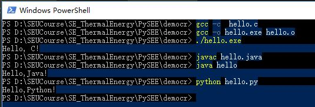

# 源码和运行

## 基本过程

源码 -> 编译、链接/解释器 -> 运行

其中：

* 任何语言的源码可以使用任意纯文本编辑软件编写

* 运行一个程序设计语言源码的过程：使用编程语言的编译/解释器命令，对源码进行处理：

   * 编译型语言：用该语言的编译器将源码编译、链接为可运行文件，然后，运行该运行文件

   * 解释型语言： 该语言的编译对源码边解释，边运行

## 集成编程环境

任何集成编程环境都是对这个过程进行了集成，以提高程序设计效率。

 * 编码：提供语言的语法高亮、提示，补全等功能

 * 对**源码->运行**的命名行过程进行封装：用户点击鼠标，软件就帮用户完成命名行的编译/解释、运行工作。

##  命令行`源码->运行`过程示例

* Windows系统终端中，命令行**源码->运行**过程示例

* Visual Studio Code终端中，命令行**源码->运行**过程示例

