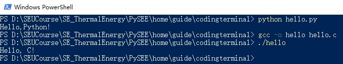
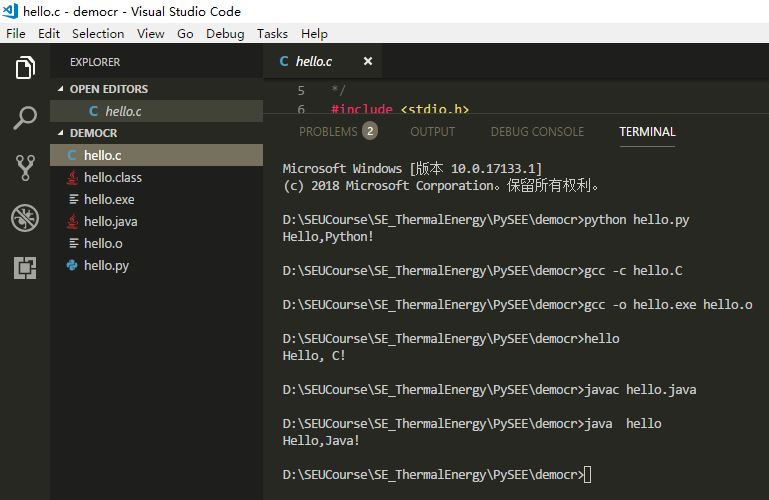

# 程序设计与终端

## 基本过程

源码 -> 编译、链接/解释器 -> 运行

其中：

* 任何语言的源码可以使用任意纯文本编辑软件编写

* 运行一个程序设计语言源码的过程：使用编程语言的编译/解释器命令，对源码进行处理：

   * 编译型语言：用该语言的编译器将源码编译、链接为可运行文件，然后，运行该运行文件

   * 解释型语言： 该语言的编译对源码边解释，边运行

## 集成编程环境

任何集成编程环境都是对这个过程进行了集成，以提高程序开发效率。

 * 编码：提供语言的语法高亮、提示，补全等功能

 * 对**源码->运行**的命名行过程进行封装：用户点击鼠标，软件帮用户完成命名行的编译/解释、运行工作。

##  命令行`源码->运行`过程示例

* Windows系统**终端**中，命令行**源码->运行**过程示例

* Visual Studio Code **终端** 中，命令行**源码->运行**过程示例

## Computer Terminal

https://en.wikipedia.org/wiki/Computer_terminal

A computer **terminal** is an electronic or electromechanical **hardware device** that is used for **entering data into, and displaying or printing data** from, a computer or a computing system. The teletype was an example of an early day hardcopy terminal, and predated the use of a computer screen by decades.

The terminal of the first working programmable, fully automatic digital Turing-complete computer, the Z3, had a keyboard and a row of lamps to show results

A personal computer can run **terminal emulator software** that replicates the **function of a terminal**, sometimes allowing concurrent use of local programs and access to a distant terminal host system.

When using a **graphical user interface** (or GUI) like the X Window System, one's display is typically occupied by a collection of windows associated with various applications, rather than a single stream of text associated with a single process. In this case, one may use a **terminal emulator** application within the windowing environment. This arrangement permits **terminal-like interaction** with the computer (for running **a command line interpreter**, for example) without the need for a physical terminal device; it can even allow the running of multiple terminal emulators on the same device.

