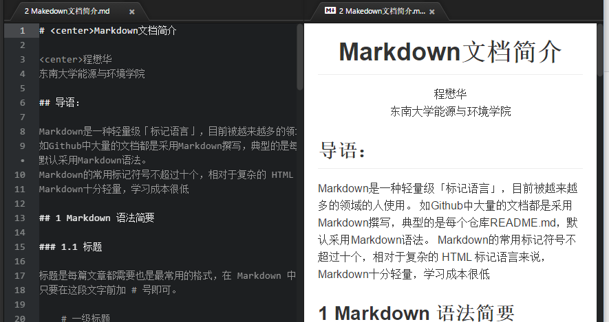

# <center>Markdown简介

<center>程懋华</center>   
<center>东南大学能源与环境学院</center>

## 导语

Markdown是一种轻量级「标记语言」，目前被越来越多的领域的人使用。
如Github中有大量Markdown文档，可以在Github中在线编辑预览Markdown文档。
Github中最常见Markdown文档，是仓库的README.md。   

Markdown的常用标记符号不超过十个，相对于复杂的 HTML 标记语言来说，
Markdown十分轻量，学习成本很低

## 1 Markdown 语法简要

### 1.1 标题

标题是每篇文章都需要也是最常用的格式，在 Markdown 中，如果一段文字被定义为标题，
只要在这段文字前加 # 号即可。

    # 一级标题

    ## 二级标题

    ### 三级标题

# 一级标题

## 二级标题

### 三级标题

以此类推，总共六级标题，建议在井号后加一个空格，这是最标准的 Markdown 语法

### 1.2 列表

在 Markdown 下，列表的显示只需要在文字前加上 - 或 * 即可变为无序列表，
有序列表则直接在文字前加1. 2. 3. 符号要和文字之间加上一个字符的空格。

#### 无序列表

    * 1A
    * 3C
    * 2B

* 1A
* 3C
* 2B

#### 有序列表

    1. 1A
    2. 3C
    3. 2B

1. 1A
2. 3C
3. 2B

### 1.3 引用

如果你需要引用一小段别处的句子，那么就要用引用的格式。
只需要在文本前加入 > 这种尖括号（大于号）即可

    > 这里是引用


> 这里是引用

### 1.4 图片与链接

插入链接与插入图片的语法很像，区别在一个 !号

#### 插入链接

```
 [东南大学](http://www.seu.edu.cn)
```
[东南大学](http://www.seu.edu.cn)
 
```
  [Markdown官网](http://daringfireball.net/projects/markdown/)
```
[Markdown官网](http://daringfireball.net/projects/markdown/)

#### 插入图片
```
  
````


#### 1.5 粗体与斜体
用两个星号包含一段文本是粗体，用一个 * 包含一段文本是斜体。

例如：

    **这里是粗体**  

    *这里是斜体*

**这里是粗体**  

*这里是斜体*

#### 1.6 表格

表格是 Markdown 比较麻烦的地方，例子如下：
```

    | 序号 |课程         | 学分 |
    | ---- |:----------:| ----:|
    | 1    |  工程热力学 | 4 |
    | 2    |  流体力学  | 3 |
    | 3    |  传热学    | 3 |
```

| 序号 |课程         | 学分 |
| ---- |:----------:| ----:|
| 1    |  工程热力学 | 4 |
| 2    |  流体力学  | 3 |
| 3    |  传热学    | 3 |

### 1.7 代码框

有关程序的文档难免在文章里引用代码，
如果要标记一小段行内代码，用反引号`把它包起来。

例如：学习Python的第一句：

		`print('hello world')`

`print('hello world')`

如果是一个代码块，用两组3个连续的反引号,把代码包裹起来形成**“代码框”**。    
如果需要句法高亮，3个连续的反引号后加语言名称，如：```python

```python
import sys

(last_key, max_val) = (None, -sys.maxint)
for line in sys.stdin:
    (key, val) = line.strip().split("\t")
    if last_key and last_key != key:
        print("%s\t%s" % (last_key, max_val)
        (last_key, max_val) = (key, int(val))
    else:
        (last_key, max_val) = (key, max(max_val, int(val)))

if last_key:
   print("%s\t%s" % (last_key, max_val))  
```

### 1.8 分割线

分割线的语法只需要三个 * 号，例如：
```
***
 >到这里，Markdown 的基本语法就可以满足日常大部分文档要求了。
 ```

 ***
 >到这里，Markdown 的基本语法就可以满足日常大部分文档要求了。
 更多的语法规则，可访问[Markdown官网](http://daringfireball.net/projects/markdown/)。

## 2 撰写Makedown文档工具

Markdown制作软件很多，“程序员”用编程环境中的更多一些。

* **使用Eclipse插件**

  Eclispe IDE中安装Markdown Editor和GitHub Flavored Markdown Viewer插件

* **使用Visual Studio Code**

  Visual Studio Code是微软开发的开源文本编辑器。 Visual Studio Code支持Markdown撰写和预览，"Ctrl+K V"打开一个同步预览窗口；
  在编辑窗口右上角的“Open View"和”View Source" （快捷键：Ctrl+Shife+V) 切换编辑/预览视图。

* **使用Atom**

  Atom是Github开发的一款开源文本编辑器，可通过插件，定制为多用途的开发环境，如C、Python、PHP，
  是撰写Markdown文档的好工具。编写时,可Ctrl+Shift+M开启同步预览，很方便。本文档就是这样typing出来的。



### 其他

*  Atom和Visual Studio Code中文文档默认UTF-8编码，在其他软件中需用对应的编码方式打开

### 参考

1. [Markdown官网](http://daringfireball.net/projects/markdown/)
2. [Mastering Markdown](https://guides.github.com/features/mastering-markdown/)
3. [VS Code Markdown](https://code.visualstudio.com/docs/languages/markdown/)
4. [VS Code Markdown updates](https://code.visualstudio.com/updates#_languages-markdown-preview/)
5. [Atom](https://atom.io/)