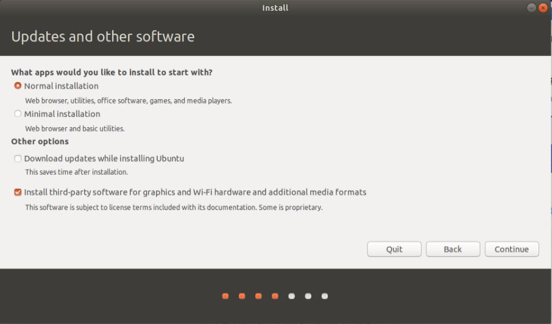
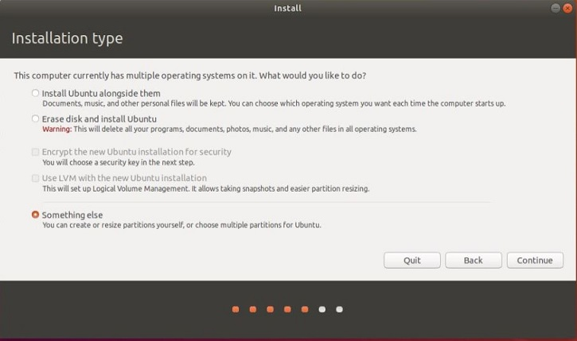
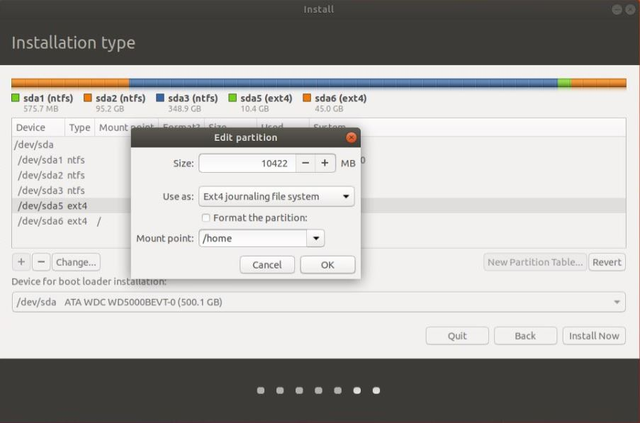
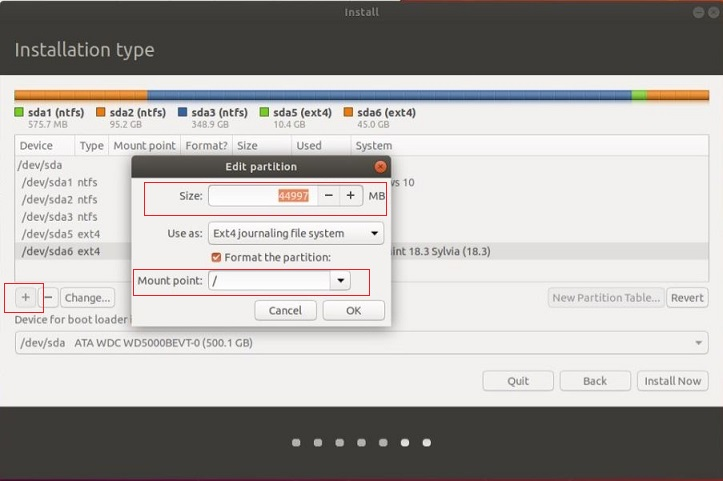
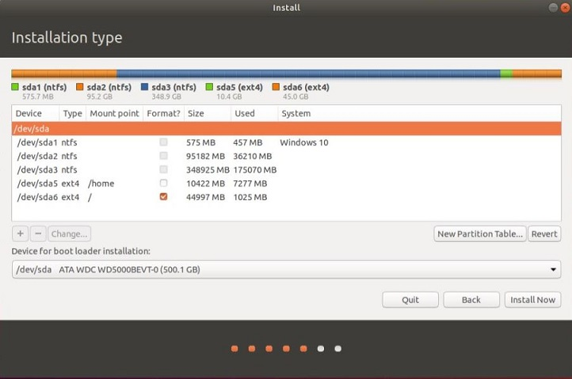
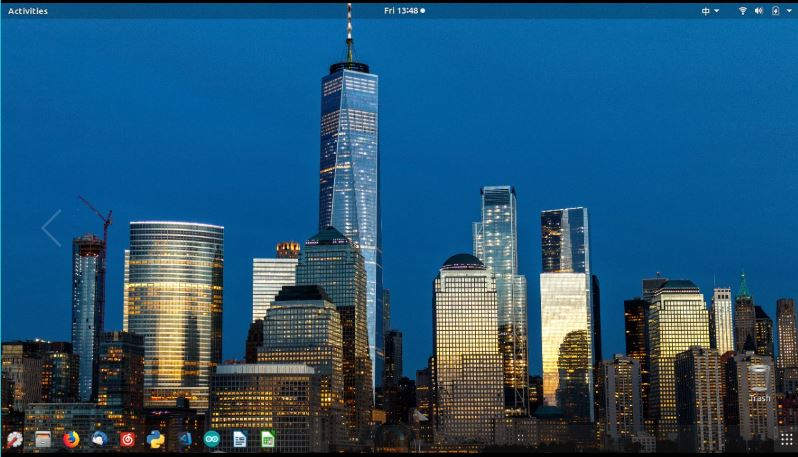

# Ubuntu系统安装和Python,C/C++开发环境的建立

在已安装Windows系统的电脑上，安装Ubuntu系统的过程简介
   
## 一、 准备安装Ubuntu系统需要的空闲硬盘空间

在Windows环境下，从`空余`的硬盘空间中划出一个`空的独立分区`，给Ubuntu使用。建议空间稍大些，如：100G


## 二、 准备Ubuntu安装U盘

* 从Ubuntu官网 https://www.ubuntu.com/download/desktop 下载**偶数年**的长期技术支持LTS版,如：Ubuntu 18.04.2 LTS

  Torrent下载： http://releases.ubuntu.com/18.04.2/ubuntu-18.04.2-desktop-amd64.iso.torrent

* 从 http://rufus.akeo.ie/  下载rufus，制作系统安装用U盘，然后，用U盘安装Ubuntu

>
>基于的Ubuntu发行版很多，建议 **新手** 使用
>
>* 1 “中国味”的UbuntuKylin: http://www.ubuntukylin.com/.  UbuntuKylin默认支持中文，预安装有WPS，搜狗拼音输入法等
>* 2 Linux Mint：https://www.linuxmint.com/ Linux Mint易用性高。英文系统系统安装后，需要补充安装中文包及其输入法(如：搜狗输入法)。Linux Mint有多个不同桌面环境的版本，如果电脑性能弱，建议使用Linux Mint Xfce版。

## 三、 安装Ubuntu

详细的安装过程可参考网络上的文档。下面是需注意的要点：

* 1 Welcome：选择语言 **English**

* 2 Wireless：选择 **不连接无线网络** 

* 3 updates and other software: 选择 **Install third-party software**




* 4 Installation type: 选择 `something else` (安装类型一定选择为 **`something else`**)



然后，在 **`空闲空间`** 中定义Ubuntu系统的分区（partition)和挂载点(Mount point)。

**注意**：一定要确定使用的是Windows的`空闲空间`，不要破坏Windows系统及其用户使用的空间.

Ubuntu系统的分区很多，快捷安装只需配置: `/home分区和挂载点` 和 `/系统分区和挂载点` 即可，其他分区由系统自动配置。

 **/home** home分区和挂载点 ：从**空闲空间**中划出一个分区作为 /home 挂载点。
  
 * 一定要有**home**挂载点和分区。如重新安装ubuntu， 仍将这个分区挂载在home下，不要格式化该分区，这样原系统中的用户文件都能保留 



 **/** 系统挂载点和分区：将余下空闲空间都划给“/” 分区，作为系统挂载点。 如果重新安装其他版本Linux，可将这个分区格式化.



定义好`/home分区和挂载点` 和 `/系统分区和挂载点` 后，可见分区情况：



点 `Install Now` 前，务必再次确认使用的是 `空闲空间`及分区的配置信息正确，不要破坏Windows系统及其用户使用的空间。

确认分区无误后，点`Install Now`,进入以下步骤：

* 5 Where are you:选择时区为 **shanghai**

* 6 Who are you: 给出用户名和密码，选择自动登录

   * 如是重装Ubuntu系统且要使用 **`原home`分区**, 用 **`原用户名`** 

然后，安装程序将从U盘安装Ubuntu到指定的硬盘分区中。安装过程需要些时间，耐心等待即可。

* 7 更新系统

系统安装后，连接网络，更新系统软件

安装配置好的Ubuntu18.04系统桌面




```bash 
$sudo apt update
$sudo apt upgrade
```

## 四、建立开发环境

### 1 Version Control: Git

```bash 
$sudo apt install git
```

### 2 C/C++ With GCC

Ubuntu 18.04 LTS内置GCC编译器，无需安装.

#### 部分Debian/Ubuntu发行版缺少GCC开发支持包，需补充安装：

$sudo apt-get install build-essential

### 3 Python3 and Tools

Ubuntu 18.04 LTS内置Python3. 但不完整，需补充: pip3、idle3。

```bash
$sudo apt install python3-pip
$sudo -H python3 -m  pip install  --upgrade pip 
$sudo apt install idle3
```
Python3相关命令都加3，如：

```bash
$python3 
$idle3
$pip3
```
### 4 Analytics & Scientific Computing Python Packages

```bash
$sudo apt install python3-numpy python3-scipy python3-matplotlib
```
### 5 Installing Jupyter

```bash
$sudo -H python3 -m pip install jupyter -i  https://pypi.tuna.tsinghua.edu.cn/simple
```
### 6 Installing IAPWS-IF97

#### SEUIF97

```bash
$sudo -H python3 -m pip install seuif97  
```
#### IAPWS

```bash
$sudo -H  python3 -m pip install iapws 
```
### 7 Visual Studio Code

#### 1 Installing Visual Studio Code

From  https://code.visualstudio.com/docs/?dv=linux64_deb  download VS Code for Debian/Ubuntu,the install in the terminal

```bash
$sudo dpkg -i [vscode filename].deb
```

#### 2 Installing  Extensions

Install Python Extension in  Visual Studio Code

* https://code.visualstudio.com/docs/languages/python

Install the Microsoft C/C++ extension

* https://code.visualstudio.com/docs/languages/cpp

#### 3 Set Python3 as the default Python Version

```json
// Path to Python, you can use a custom version of Python by modifying this setting to include the full path.
  "python.pythonPath": "python3",
```

### 8 Installing GSL

```bash
$sudo apt install gsl-bin
$sudo apt install libgsl-dev
```
### 9 Installing Gnuplot

```bash
$sudo apt install gnuplot
```

## 六、英文版Ubuntu补充中文支持

 为Ubuntu补充中文支持的基本环节,如下：

1. 安装中文语言支持包

2. 安装中文输入法，建议使用**搜狗拼音输入法**

3. 配置搜狗拼音输入法为系统中文输入方法

具体方法，可上网查询。

## Reference

* How to install and Get Started with Ubuntu Desktop 16.04LTS  http://www3.ntu.edu.sg/home/ehchua/programming/howto/Ubuntu_HowTo.html

* Programmer's Survival Guide for Mac & Ubuntu  http://www3.ntu.edu.sg/home/ehchua/programming/howto/Unix_SurvivalGuide.html

* Linux Mint Guide(中文版） https://linuxmint.com/documentation/user-guide/Cinnamon/chinese_16.0.pdf

* The Linux Mint Installation Guide https://linuxmint-installation-guide.readthedocs.io/en/latest/index.html

* 优麒麟（UbuntuKylin）18.04 简易安装手册
http://www.ubuntukylin.com/public/pdf/UK1804install.pdf
