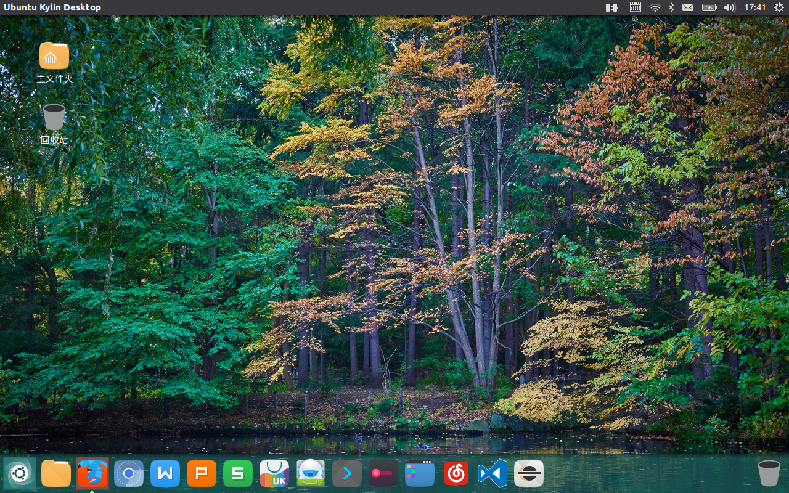

# Ubuntu系统安装和Python开发环境的建立

## Windows环境要求

  Windows是同学们的主要工作环境，因此，在已安装Windows系统的电脑上，双系统模式是安装的Ubuntu适当安装方式。

  安装前，在Windows环境下，从空余的硬盘空间中划分出一个空的独立分区，供安装Ubuntu使用。

  基本安装空间10G左右就可以了。为了以后工作方便，更大些为好，如：50G

## 安装Ubuntu

Ubuntu发行版很多，建议使用“中国味”的UbuntuKylin 16.04.01 LTS版。

从Ubuntukylin官网 http://www.ubuntukylin.com/  下载ubuntu1kylin16.04.01版iso,

从 http://www.pendrivelinux.com/universal-usb-installer-easy-as-1-2-3/ 下载Universal-USB-Installer制作U盘系统

然后用U盘安装双系统。安装过程，可参考：

* U盘安装Ubuntu 16.04 Beta2（与Win10双启动）

  * http://www.linuxdiyf.com/linux/19782.html

### 安装要点
* 1 Welcome界面：选择语言 ”English”
* 2 Wireless界面：选择 不连接无线网络 
* 3 Preparing to install Ubuntu界面: 选择 安装第三方软件
* 4 Installation type界面: 选择 **“something else”**
   * 自定义系统分区和挂载点，简单可靠的方式如下：
       * /home： 挂载点和分区：从空闲空间中划分出一个“logic”  分区， 作为/home 挂载点，注意一定是“logic”  分区（这是因为一个硬盘可以划分的主分区数量有限）：
         **注意：**一定要有home挂载点和分区。如重新安装ubuntu，还是将这个分区挂载在homo下，不要选择格式化这个分区，这样原来系统中的用户文件都能保留， 
       *  /： 挂载点和分区：将余下的空闲空间划分出一个“主”  分区，作为系统挂载点. 如果重新安装ubuntu，可以将这个分区格式化
         分好区后，点安装
* 5 Where are you选择 时区为“shanghai”
* 6 Who are you: 给用户名和密码，选择自动登录（如是重新装系统，且要用原来的home ,建议用原用户名）

## Python3开发环境

Ubuntu16.04.01系统缺省安装有Python3.5，但不完整，需补充: pip3、idle3。

在线安装：
```bash
    $sudo apt install python3-pip
    $sudo -H python3 -m  pip install  --upgrade pip 
    $sudo apt install idle3
```

### 安装scipy

apt在线安装
```bash
$sudo apt install python3-numpy python3-scipy python3-matplotlib
```

### 安装Jupyter

pip3在线安装
 
```bash
$sudo –H pip3 install jupyter
```
### 安装SEUIF97

1.copy SEUIF97.so to a default path of Linux shared lib
```bash
   $sudo cp SEUIF97.so /usr/lib/
```

2.copy seuif97.py to a default path of Python lib
```bash  
   $sudo cp seuif97.py /usr/lib/python3.5/
```

## Eclipse开发环境

### 安装JDK

   Ubuntukylin16.04缺省没有安装JDK。如下安装openjdk

```bash 
   $sudo apt openjdk-8-jre
```

###  安装Eclipse IDE
    
* 1. 下载Linux版的Eclipse CDT，解压
   
* 2. Python开发：安装Pydev插件

* 3. C/C++开发: Ubuntukylin16.04系统内置gcc编译器，无需安装

## 系统桌面

* Ubuntukylin 16.04.01 

适用对象：需要中文环境的Linux新用户

 

* Linux Mint 18.1 “Serena” Xfce Edition 

适用对象：相应速度要求高用户，硬件性能较弱的计算机

 