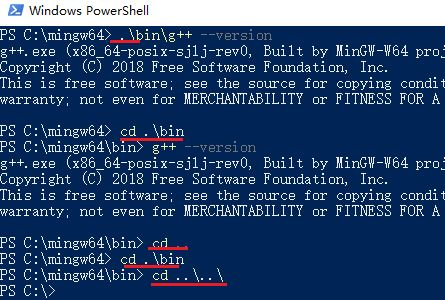
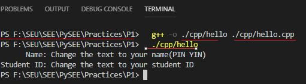

# Windows File System and Path

## 1 Windows File System

In Windows, files are organized in directories (also called "folders"). The directories are organized in a hierarchical tree structure, starting from the so-called root directory for each of the hard drive (as illustrated). A directory may contain sub-directories and files. A sub-directory may contain sub-sub-directories and files, and so on.

Windows' file system is further organized in drives, identified by a drive letter followed by a colon, e.g., `C:, D: and E:`. 

Each drive has its own `root` directory, such as `C:\, D:\ and E:\`, where the `"\"` (back-slash) denote the root directory of each drive.

Windows' file system is `NOT` case-sensitive, a rose is a Rose, and is a ROSE.

## 2 Current Drive and Current Working Directory

Each terminal session maintains a so-called `current drive` and `current working directory`, which is shown in the prompt in the form of 
```
drive:\current-directory> 
```

All `relative` pathnames/filenames are relative to this current drive and working directory.

Every running program in the terminal has a **“current directory”**, which is the default directory for most operations.

## 3 Drive-Letter, Pathname and Filename

Files are organized into directories (also called “folders”).

To reference a file in Windows' file system, you need to provide `the drive letter, the directory name (aka pathname) and the filename`. 

For example, in `C:\mingw64\bin\gcc.exe`, 

* the drive is `C:` 

* the pathname is `C:\mingw64\bin\` 

* the filename is `gcc.exe`.

The leading "`\`" (back-slash) denotes the `root` directory for that drive. The sub-directories are separated by "`\`" (back-slash).

The string `C:\mingw64\bin` that identifies a file or directory is called a  **path**.

文件位于文件系统的某个路径中，访问文件时需要给出文件的路径。

The pathname can be specified in two ways:

### Absolute Pathname:

 An absolute pathname begins from the root directory of a drive. It starts with `X:\` (where X denotes the drive letter and the leading "\" denotes the root), and contains all the sub-directories leading to the file (separated by "\"). 

For example,
```
 "C:\mingw64\bin\.
```

如C++编译器文件:`C:\mingw64\bin\g++.exe`，绝对路径是`C:\mingw64\bin`。在任何路径中，都可以用绝对路径访问指定文件


Absolute path: a path that begins with drive letter(e.g C:\() does not depend on the current directory

绝对路径：从 `盘符` 开始的路径

### Relative Pathname

 A relative pathname is relative to the so-called `current drive and current working directory`. 

For example, if the current drive and working directory is 
```
"C:\mingw64\"
```
then the relative path 
```
"bin\" 
```
resolves to 
```
"C:\mingw64\bin\". 
```
A relative pathname does NOT begin with a leading "`\`" (back-slash).

relative path：a path relates to the current directory

相对路径：从 `当前路径` 开始的路径

其中，

* `.`表示当前路径. `.`可以缺省，所以，如果一个文件名前没有路径信息，就指在当前路径下\


* `..`为当前路径的上一级目录

### 如当前路径为C:\mingw64\bin

进入上一级目录C:\mingw64命令是: `cd ..`



### 如hello.cpp位于 F:\SEU\SEE\PySEE\Practices\P1\cpp 路径

在不同当前路径终端中,使用g++编译hello的命令如下:

* 路径：F:\SEU\SEE\PySEE\Practices\P1\

   

* 路径：F:\SEU\SEE\PySEE\Practices\

  

## 在`源码所在路径打开终端`编译

为了避免不同 **当前路径** 对应不同 **相对路径** 的复杂性，在**源码所在路径打开终端**，然后，在当前路径终端中，使用g++编译源码hello.cpp

Open the terminal(running cmd/powershell) in the directory of source code files:`F:\SEU\SEE\PySEE\Practices\P1\cpp`, then use `g++` to compile `hello.cpp`


The current directory of  **cmd/powershell** is `F:\SEU\SEE\PySEE\Practices\P1\cpp`

* **cmd/powershell** looks for `g++` in the current directory and the system environment variable **Path**

* **g++** has the same current directory, so it also looks for `hello.cpp` in the current directory

* **cmd/powershell** looks for `./hello.exe` in the current directory 