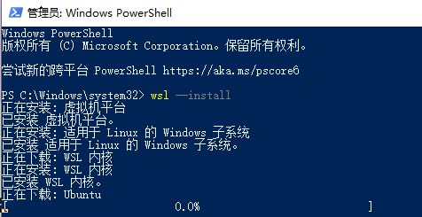
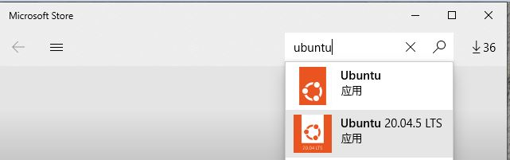
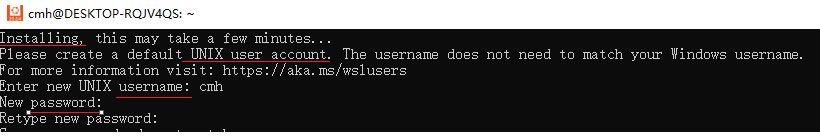
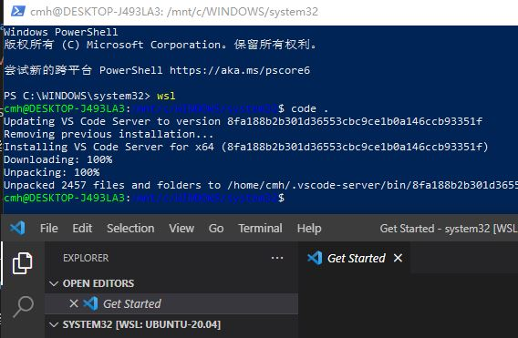

# Windows Linux子系统(WSL)安装及开发环境建立

## 安装WSL

* https://learn.microsoft.com/zh-cn/windows/wsl/install

1. 安装WSL

**管理员** PowerShell 命令提示符中输入命令

```bash
wsl --install
```

然后, **重启计算机**来安装运行适用于 Linux 的 Windows 子系统 (WSL) 所需的全部内容。



2. 通过 Microsoft Store安装Ubuntu分发版



3. 初始化Ubuntu分发版
 




### Visual Studio Code中使用WSL

1. [安装Visual Studio Code Remote插件](https://code.visualstudio.com/docs/remote/wsl)

2. 运行VS　Code

在ubuntu终端执行
 
 ```bash
   $code .
 ```



### 安装Ubuntu分发版开发软件

在Ubuntu终端执行

```bash
$sudo apt install build-essential
$sudo apt install python3-pip
$sudo apt install python-is-python3
$sudo apt install git
```

**参考链接**

* [VS code: Developing in WSL](https://code.visualstudio.com/docs/remote/wsl)

* [VS code: Using C++ and WSL in VS Code](https://code.visualstudio.com/docs/cpp/config-wsl#nodejs-articles)
