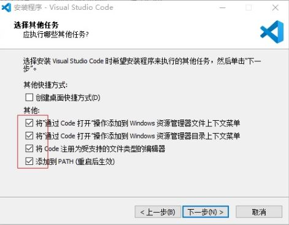
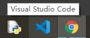
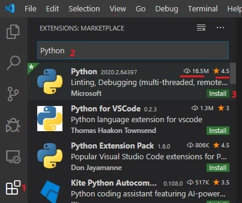

**Install Software**

* **注意**：新版numpy和Python解释器及其他一些软件包，有兼容性问题，所以，建议安装稍旧些的版本

  *  Python 3.8.7
 
  *  Numpy 1.18.0 

<!-- TOC -->

- [A: Python & Package](#a-python--package)
  - [A.1 Installing Python](#a1-installing-python)
  - [A.2 Install Package using pip](#a2-install-package-using-pip)
    - [A.2.1 set the faster mirror index site of PyPi](#a21-set-the-faster-mirror-index-site-of-pypi)
    - [A.2.2 update pip to the most recent version](#a22-update-pip-to-the-most-recent-version)
    - [A.2.3 Install  Packages](#a23-install--packages)
- [B: Install Jupyter Notebook](#b-install-jupyter-notebook)
- [C: Install GCC for Windows：TDM-GCC](#c-install-gcc-for-windowstdm-gcc)
- [D: Visual Studio Code](#d-visual-studio-code)
  - [D.1 Install Visual Studio Code](#d1-install-visual-studio-code)
  - [D.2 Install Extension: Python,C/C++](#d2-install-extension-pythoncc)
- [E: Install Git for Windows](#e-install-git-for-windows)

<!-- /TOC -->
## A: Python & Package

### A.1 Installing Python 

Goto [the official Python site](https://www.python.org/downloads/), you can use typically **Download the latest version of Python** `button` that appears first on the page to get the latest version of Python.

In the example ,we use [Python 3.8.7 for Windows x86-64](https://www.python.org/ftp/python/3.8.7/python-3.8.7-amd64.exe)  

*  Make sure you **check** option **Add Python 3.8 to PATH**

   

### A.2 Install Package using pip

#### A.2.1 set the faster mirror index site of PyPi

```bash
>pip config set global.index-url https://mirrors.aliyun.com/pypi/simple/
```

or 

```bash
>pip config set global.index-url https://pypi.tuna.tsinghua.edu.cn/simple
```

#### A.2.2 update pip to the most recent version

```bash
>python -m pip install -U pip
```

#### A.2.3 Install  Packages

```bash  
>python -m pip install autopep8 pylint
```

```bash   
> python -m pip install numpy==1.18.0 scipy matplotlib
``` 

```bash   
> python -m pip install  coolprop 
``` 

## B: Install Jupyter Notebook

To install Jupyter,run the following command in a terminal:

```bash   
>python -m pip install jupyter
```

```bash   
>python -m pip install notebook==6.1.5
```

Install Jupyter Notebook extension

```bash   
>python -m pip install jupyter_contrib_nbextensions
```

Install javascript and css files

```bash   
>jupyter contrib nbextension install --user
```

## C: Install GCC for Windows：TDM-GCC

Goto [TDM-GCC](https://jmeubank.github.io/tdm-gcc/) to download the latest available version of gcc compiler for **Windows64** - `tdm64-gcc-9.2.0.exe`,run the installer.

After the install, **Rename**  `.\bin\mingw32-make.exe` to  `.\bin\make.exe`

## D: Visual Studio Code

### D.1 Install Visual Studio Code 
 
* Download  Visual Studio Code https://code.visualstudio.com/, then install

   

* Add the shortcut of VS code to `Task bar`

   
 
### D.2 Install Extension: Python,C/C++

* Python https://code.visualstudio.com/docs/languages/python

* C/C++ https://code.visualstudio.com/docs/languages/cpp
        
  

## E: Install Git for Windows

Download Git for Windows: https://git-scm.com/ ,then install

