# Install and Use Software

Firstly，You **MUST** [setup the working directory for the course](./WorkingDir.md)
<!-- TOC -->

- [Install and Use Software](#install-and-use-software)
  - [A:Python & PyPI](#apython--pypi)
    - [A.1 Installing Python and Coding](#a1-installing-python-and-coding)
      - [A.1.1 Customize Installing Python](#a11-customize-installing-python)
      - [A.1.2  Using Python Shell(command-line model)](#a12--using-python-shellcommand-line-model)
      - [A.1.3 Using IDLE(script mode)](#a13-using-idlescript-mode)
    - [A.2 The Python Package Index(PyPI)](#a2-the-python-package-indexpypi)
    - [A.3 Install Packages](#a3-install-packages)
      - [A.3.1 update `pip` to the most recent version](#a31-update-pip-to-the-most-recent-version)
      - [A.3.2 set `tsinghua` as default site](#a32-set-tsinghua-as-default-site)
      - [A.3.3 Install autopep8, pylint](#a33-install-autopep8-pylint)
      - [A.3.4 Scipy](#a34-scipy)
    - [A.3.5 CoolProp:](#a35-coolprop)
  - [B:Jupyter Notebook](#bjupyter-notebook)
    - [B.1 Install & Start-up Jupyter Notebook](#b1-install--start-up-jupyter-notebook)
      - [Install Jupyter Notebook extensions(optional)](#install-jupyter-notebook-extensionsoptional)
    - [B.2 Literate programming your Jupyter Notebook in the `specific working folder`](#b2-literate-programming-your-jupyter-notebook-in-the-specific-working-folder)
      - [B.2.1 Start Jupyter Notebook in a specific folder with `batch` file](#b21-start-jupyter-notebook-in-a-specific-folder-with-batch-file)
      - [B.2.2 Create a new notebook document](#b22-create-a-new-notebook-document)
    - [B.3 Using the Jupyter Notebook of PySEE/home](#b3-using-the-jupyter-notebook-of-pyseehome)
  - [C:Install GCC for Windows：TDM-GCC](#cinstall-gcc-for-windowstdm-gcc)
  - [D:Visual Studio Code](#dvisual-studio-code)
    - [D.1 Install and setup Visual Studio Code](#d1-install-and-setup-visual-studio-code)
      - [D.1.1 Install](#d11-install)
      - [D.1.2 Set the default type of a new file](#d12-set-the-default-type-of-a-new-file)
      - [D.1.3 Set Display Language](#d13-set-display-language)
    - [D.2 Install Extension: Python,C/C++](#d2-install-extension-pythoncc)
    - [D.3 Using Visual Studio Code: Python,C/C++](#d3-using-visual-studio-code-pythoncc)
      - [D.3.1 Getting Started with Python in VS Code](#d31-getting-started-with-python-in-vs-code)
      - [D.3.2 Getting Started with C/C++ in VS Code](#d32-getting-started-with-cc-in-vs-code)
      - [D.3.3 Disable Precompiled header caching](#d33-disable-precompiled-header-caching)
  - [E: Using Git](#e-using-git)
    - [E.1 Install Git for Windows](#e1-install-git-for-windows)
    - [E.2 Using Git with  PySEE/home](#e2-using-git-with--pyseehome)
      - [E.2.1 Clone the PySEE/home to your computer](#e21-clone-the-pyseehome-to-your-computer)
      - [E.2.2 Updating to The Latest Version](#e22-updating-to-the-latest-version)
      - [E.2.3 Discard Changes](#e23-discard-changes)
  - [References](#references)

<!-- /TOC -->
## A:Python & PyPI

Python is one of those rare languages which can claim to be both simple and powerful. You will find yourself pleasantly surprised to see how easy it is to concentrate on the solution to the problem rather than the syntax and structure of the language you are programming in.

Before you start to code Python, you will need Python on your computer.

### A.1 Installing Python and Coding

#### A.1.1 Customize Installing Python

Goto [the official Python site](https://www.python.org/downloads/), you can use typically **Download the latest version of Python** `button` that appears first on the page to get the latest version of Python.

* You may choose the specific Python release for you, e.g. [**Python for Windows**](https://www.python.org/downloads/windows/)

In the example ,we use [Python 3.8.7 for Windows x86-64](https://www.python.org/ftp/python/3.8.7/python-3.8.7-amd64.exe)  

*  Make sure you **check** option **Add Python 3.8 to PATH**

   

Python is an interpreted language. Python programs are executed by an interpreter. 
  
There are two ways to use the interpreter: 
  
* `command-line` mode
  
* `script` mode

#### A.1.2  Using Python Shell(command-line model)

For Windows users, open [the terminal](./CodingWithTerminal.md) in Windows, click the `Win+R`. In the dialog box, type `cmd` and press `[enter]` key.

Then, type `python` and in the terminal(if you have set the  `PATH` variable appropriately)

* [Computer Terminal](./CodingWithTerminal.md)

You should see the  **Shell**  symbol `>>>` indicating that the interpreter is expecting the user to type some commands(Python code) into the shell.


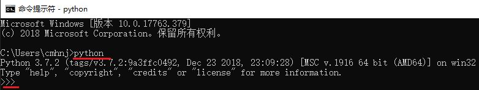


At the shell prompt `>>>`,if you type a line of code and hit `[enter]`, the interpreter displays the result:

For example, type：

```python
print('Python is a living language!')
```
followed by the `[enter]` key. You should see the words `Python is a living language` printed to the screen.

type：

```python
2*3+6
```
followed by the `[enter]` key. You should see the  value `12` printed to the screen.

**Quit the Python shell**

For Windows users, press `[ctrl + z]` followed by the `[enter]`  key.

  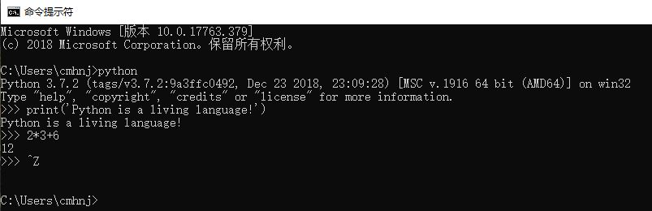   

#### A.1.3 Using IDLE(script mode)

Programmers use some sort of **text editor** that is part of an integrated development environment (IDE) to edit source code of computer programs. 

The **IDLE** is the simple IDE that comes as part of the standard Python installation package.

It provide you with the `File`,`Edit` and `Save As` menus to  edit and save Python source files(script) have names that end with  `.py`.

To execute the program(script), click menu:`Run`->`Run Module`.

  

> The **IDLE** also open a **shell** window into which you can type `Python commands`

### A.2 The Python Package Index(PyPI)

The Python Package Index(PyPI) is a repository of software for the Python programming language.: https://pypi.org/

`pip` is a package manage for Python. It makes installing and uninstalling Python packages

* Installing Python Modules : https://docs.python.org/3/installing/

**A.2.1 Install** 

The following command will install the latest version of a module and its dependencies from the Python Packaging Index:

```bash
>python -m pip install SomePackage  
```

Install the  multiple modules at the one `pip install` command

```bash
>python -m pip install SomePackage1  SomePackage2 
```

**A.2.2 Upgrading**

Normally, if a suitable module is already installed, attempting to install it again will have no effect. Upgrading existing modules must be requested **explicitly**:

```bash
>python -m pip install --upgrade SomePackage  
```
or

```bash
>python -m pip install -U SomePackage  
```

**A.2.3 Install from an alternate index**

```bash
>python -m pip install SomePackage  -i  the-url-of-an-alternate-index
``` 

Install from `@tsinghua` for the **higher speed**: https://pypi.tuna.tsinghua.edu.cn/simple 

```bash
>pip  install packagename  -i  https://pypi.tuna.tsinghua.edu.cn/simple
```

**A.2.4 set one alternate index site as the default site**

```bash
>pip config set global.index-url https://pypi.tuna.tsinghua.edu.cn/simple
```

**A.2.5 uninstall**  

```bash
>pip uninstall packagename  
```

**A.2.6 Show help for commands**

```bash
>pip  help  
```

### A.3 Install Packages

#### A.3.1 update `pip` to the most recent version

```bash
>python -m pip install -U pip -i  https://pypi.tuna.tsinghua.edu.cn/simple
```

   

#### A.3.2 set `tsinghua` as default site 

```bash
>pip config set global.index-url https://pypi.tuna.tsinghua.edu.cn/simple
```

#### A.3.3 Install autopep8, pylint

```bash  
>python -m pip install autopep8 
>python -m pip install pylint
```
or

```bash  
>python -m pip install autopep8 pylint
```

#### A.3.4 Scipy
   
Numpy, Scipy, Matplotlib https://www.scipy.org/install.html 

```bash   
> python -m pip install numpy scipy matplotlib
``` 

### A.3.5 CoolProp: 

```bash   
> python -m pip coolprop 
``` 

## B:Jupyter Notebook

Interactive analysis and literate programming

http://jupyter.org/

The Jupyter Notebook is an open-source **web application** that allows you to create and share **`documents`** that contain **`live code`**, equations, visualizations and narrative **`text`**. 

Uses include: data cleaning and transformation, numerical simulation, statistical modeling, data visualization, machine learning, and much more.

   

### B.1 Install & Start-up Jupyter Notebook

To install Jupyter,run the following command in a terminal:

```bash   
>python -m pip install jupyter
```

To start up Jupyter, run the following command in a terminal:

```bash   
>jupyter notebook
```

This will launch a new browser window (or a new tab) showing the Notebook Dashboard, a sort of control panel that allows (among other things) to select which notebook to open.

When started, the Jupyter Notebook can access only files within `its start-up folder (including any sub-folder)`.

#### Install Jupyter Notebook extensions(optional)

This repository 

https://github.com/ipython-contrib/jupyter_contrib_nbextensions

contains a collection of extensions that add functionality to the Jupyter notebook.

Install the python package
```bash   
>python -m pip install jupyter_contrib_nbextensions
```
Install javascript and css files

```bash   
>jupyter contrib nbextension install --user
```

### B.2 Literate programming your Jupyter Notebook in the `specific working folder`

#### B.2.1 Start Jupyter Notebook in a specific folder with `batch` file 

* `1` make **the specific folder** for  your Jupyter Notebook,for example: `D:/mynotebook`

* `2` make the **"start.bat"** batch file with the content **`jupyter notebook`** through Windows's **notepad.exe**(记录本)  in the working folder of your Jupyter Notebook

* `3` Double-click **`start.bat`**，the **Jupyter Notebook**  server will automatically open up in your default web browser

   

#### B.2.2 Create a new notebook document

To create a new notebook, click the `New` button on the top of the right hand side and select the `“Python 3”` option. You should see something like the follow Figure. 

If this is your first time, try clicking on the empty `Code cell` and entering a line of Python code. Then press `Shift-Enter` to execute it.

Notebooks consist of a linear sequence of cells. There are two basic cell types:

* `Code cells`: Input and output of live `code` that is run in the kernel

* `Markdown cells`: Narrative `text` with embedded `LaTeX` equations

You can change the cell type by using the `Cell` menu or the toolbar.

You may click  `File`->`Save As...` to save the notebook file as a given name with the extension `.ipynb`.

   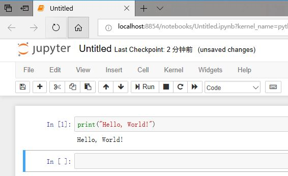 
  
### B.3 Using the Jupyter Notebook of PySEE/home

pre-installed:Python3 and Jupyter Notebook

**B.3.1**  Download the zip file

Go to the repo **home** on the Github: https://github.com/PySEE/home ,then download `home.zip` to your computer

   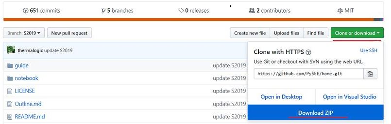

**B.3.2** Open the notebooks in Jupyter Notebook

 unzip `home.zip`, double-click  `nb.bat`(OS:Windows)  in the sub-folder of **notebook** of `home`. This will open a web page in your browser with a list of the available notebooks.

## C:Install GCC for Windows：TDM-GCC

Goto [TDM-GCC](https://jmeubank.github.io/tdm-gcc/) 

**Download** the latest available version of gcc compiler for **windows64** - `tdm64-gcc-9.2.0.exe`,run the installer

then, **RENAME**  `.\bin\mingw32-make.exe` to  `.\bin\make.exe`

## D:Visual Studio Code

Visual Studio Code is a lightweight but powerful source code editor which runs on your desktop and is available for Windows, macOS and Linux. It comes with built-in support for JavaScript, TypeScript and Node.js and has a rich ecosystem of extensions for other languages (such as C++, C#, Python, PHP, Go) and runtimes (such as .NET and Unity). 

### D.1 Install and setup Visual Studio Code 
 
#### D.1.1 Install

* Download  Visual Studio Code https://code.visualstudio.com/, then install

   

* Add the shortcut of VS code to `Task bar`

   
 
#### D.1.2 Set the default type of a new file

By default if you open a new file, it's set for `Plain Text`,

You can set the `default language` at either the user or workspace settings level using `files.defaultLanguage`:

If the item is configured to `${activeEditorLanguage}`, it will use the language mode of the currently active text editor if any.


#### D.1.3 Set Display Language

Press `Ctrl+Shift+P` ,then type `disp`, get the item `Config Display Lanuage`, choice the item,then set the language 

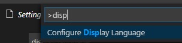

### D.2 Install Extension: Python,C/C++

* Python https://code.visualstudio.com/docs/languages/python

* C/C++ https://code.visualstudio.com/docs/languages/cpp
        
     * [Using GCC with MinGW](https://code.visualstudio.com/docs/cpp/config-mingw)

  

### D.3 Using Visual Studio Code: Python,C/C++

#### D.3.1 Getting Started with Python in VS Code

 https://code.visualstudio.com/docs/python/python-tutorial

It's simple to run Python source code file. `Right-click` in the editor and select `Run Python File in Terminal` (which saves the file automatically):
 
   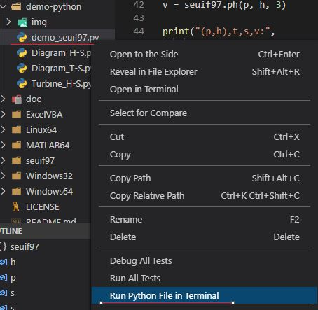

   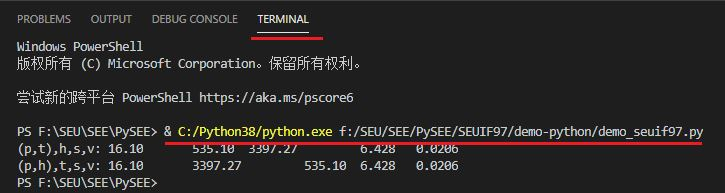

#### D.3.2 Getting Started with C/C++ in VS Code

* **1** Open the PowerShell terminal in the folder of C++ code file

   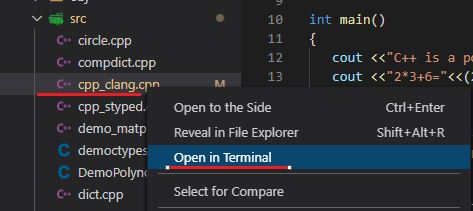

   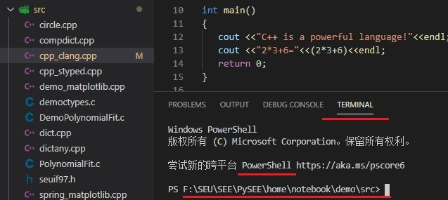

* **2** Using g++ to compile the C++ code to the executable file,then running the exe file in the terminal

   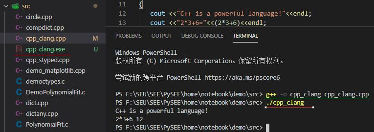

#### D.3.3 Disable Precompiled header caching

The defualt Intelli Sense Cache Size is 5120 MB. 

set the `"C_Cpp.intelliSenseCacheSize:"0` to disable Precompiled header caching   

 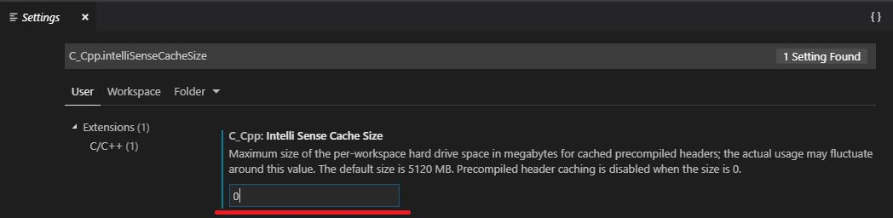

## E: Using Git

We **recommend** that you use [git](https://git-scm.com) to handle everything in the course: the repositories of PySEE,your projects,etc. 

### E.1 Install Git for Windows

Download Git for Windows: https://git-scm.com/ ,then install

### E.2 Using Git with  PySEE/home 

After you have installed **git**, You may use the following **commands:** to clean,update and checkout 

#### E.2.1 Clone the PySEE/home to your computer

```bash
>git clone https://github.com/PySEE/home.git
```

**Cloning the `B2021` branch of repository `shallowly` for saving bandwidth**

```bash
>git clone --depth 1 -b B2021 https://github.com/PySEE/home.git
```
* -b B2021 
* --depth 1 
  * Create a shallow clone with a history truncated to the specified number of commits

When you clone a repository you set up a copy on your computer. This will create a folder **home** on your computer with the files in sub-folders.

#### E.2.2 Updating to The Latest Version

As we release new files or  update files, you'll have to update your repository. You can do this by changing into the `home` directory and executing:

```bash
git pull
```

That's it - you'll have the latest version of the repository.

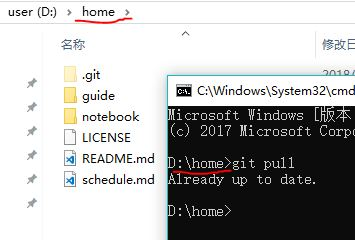

#### E.2.3 Discard Changes

If you change the contents of home, you may  `checkout` to discard all changes

```bash
>git checkout .
```

>you may also use any **GUI git client** to clone, update and checkout this repository, for example:  [Visual Studio Code](https://code.visualstudio.com/) ,or [GitHub Desktop](https://desktop.github.com/)


## References

* Python3:  https://www.python.org/downloads/
  
* Jupyter: http://jupyter.org/

* Numpy、Scipy and Matplotlib http://www.scipy.org/ 

* Visual Studio Code：https://code.visualstudio.com/

* Git https://git-scm.com

* TDM-GCC https://jmeubank.github.io/tdm-gcc 

  