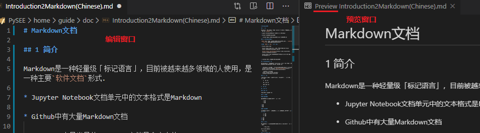
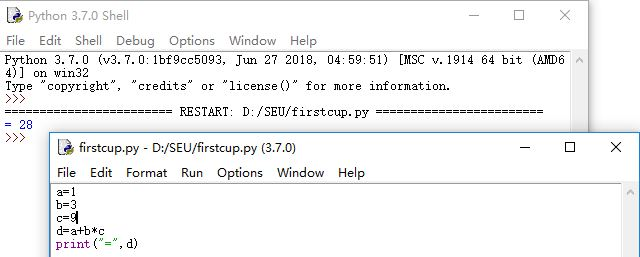

# Markdown文档

## 1 简介

Markdown是一种轻量级「标记语言」.

Markdown文件是`纯文本`文档，不同于 `富媒体`文档，如Word、PowerPoint

* 内容字符

* 标志字符

Markdown的`常用标记符号`不超过十个，相对于其他复杂的标记语言，如：HTML来说，Markdown十分轻量，学习成本很低。

目前被越来越多领域的人使用，是互联网上最流行的写作语言。

* `软件文档`主要形式

* Jupyter Notebook文档单元中的文本格式是Markdown

* Github中有大量Markdown文档

  * Github中最常见的Markdown文档是仓库中的README.md

## 2 Markdown编辑

Markdown`纯文本`文档，不同于 `富媒体`的 `所见即所得` 文档，如Word、PowerPoint

**Markdown文档` 撰写`、 `预览` 是分开的**

  

* [Visual Studio Code Markdown](https://code.visualstudio.com/docs/languages/markdown/)

  * Visual Studio Code文档默认UTF-8编码，在其他软件中需用UTF-8编码打开.

* 在Github中可在线编辑预览Markdown文档

## 3 Markdown语法简要

Markdown格式没有统一标准，Github支持的Markdown格式有其特色(GitHub Flavored Markdown) [Mastering Markdown](https://guides.github.com/features/mastering-markdown/) 
   
* 其pdf的格式说明文件 https://guides.github.com/pdfs/markdown-cheatsheet-online.pdf

### 3.1 标题

在Markdown中，如果一段文字被定义为标题：文字前加一个 # 号 和 一个空格。

    # 一级标题

    ## 二级标题

    ### 三级标题

# 一级标题

## 二级标题

### 三级标题

以此类推，总共六级标题

### 3.2 列表

#### 无序列表

无序列表的显示只需要在文字前加上 - 或 * 

    * 1AA
    * 3CA
    * 2BD

* 1AA
* 3CA
* 2BD

  
#### 有序列表

有序列表：在文字前加序号符号1. 2. 3; 序号符号和文字之间加上 **一个空格**.

    1. 1AA
    2. 3CA
    3. 2BD

1. 1AA
2. 3CA
3. 2BD


### 3.3 引用

如果需要引用一小段别处的句子，就要用引用格式。在文本前加入  > (大于号):

     > 这里是引用

引用显示效果如下：

> 这里是引用

### 3.4 链接与图片

#### 插入链接

```
 [东南大学](http://www.seu.edu.cn)
```
[东南大学](http://www.seu.edu.cn)

#### 插入图片

插入图片与插入链接与的语法很像，区别在加一个 ! 号

     


### 3.5 粗体与斜体

用两个星号**包含一段文本是粗体，用一个 * 包含一段文本是斜体。

例如：

    **这里是粗体**  

    *这里是斜体*

**这里是粗体**  

*这里是斜体*

### 3.6 表格

    | 序号 |课程         | 学分 |
    | ---- |:----------:| ----:|
    | 1    |  工程热力学 | 4 |
    | 2    |  流体力学  | 3 |
    | 3    |  传热学    | 3 |


| 序号 |课程         | 学分 |
| ---- |:----------:| ----:|
| 1    |  工程热力学 | 4    |
| 2    |  流体力学  | 3    |
| 3    |  传热学    | 3    |


### 3.7 代码框

文档中引用代码.

如果要标记一小段**行内**代码，用 反引号` 把它包起来。

例如：
       
      学习Python的第一句：`print('Hello World!')`

学习Python的第一句:`print('Hello World!')`

如果是一个**代码块**，用两组3个连续的反引号```, 把代码包裹起来形成 **“代码框”**。 

如果需要句法高亮，3个连续的反引号后加语言名称，

如：```python


        ```python
        # Square an integer, the hard way X**2
        x = 4  
        ans = 0   
        itersLeft = x      # initial value ：X

        while (itersLeft != 0):
            ans = ans + x  # x**2  to repetitive +
            itersLeft = itersLeft - 1  

        print(str(x) + '*' + str(x) + ' = ' + str(ans))   
        ```


```python
# Square an integer, the hard way X**2
x = 4  
ans = 0   
itersLeft = x      # initial value ：X

while (itersLeft != 0):
    ans = ans + x  # x**2  to repetitive +
    itersLeft = itersLeft - 1  

print(str(x) + '*' + str(x) + ' = ' + str(ans)) 
```

如：```cpp

        ```cpp
        #include <iostream>
        using namespace std;

        int main()
        {
            int x = 12;
            if( x % 2==0 )
            {
                cout << "Even" <<endl; 
                cout <<x<<endl; 
                cout <<x%2<<endl; 
            }
           else
           { 
            cout << "Odd" << endl;
           };
           return 0;
        }  
        ```

```cpp
#include <iostream>
using namespace std;

int main()
{
    int x = 12;
    if( x % 2==0 )
    {
        cout << "Even" <<endl; 
        cout <<x<<endl; 
        cout <<x%2<<endl; 
    }
   else
   { 
       cout << "Odd" << endl;
   };
   return 0;
}  
```

### 3.8 分割线

分割线用三个 --- 号，例如：

     ---
     >到这里，**Markdown**的基本语法就可以满足*日常*大部分文档要求了。


---
 >到这里，**Markdown**的基本语法就可以满足*日常*大部分文档要求了。

### 3.9 换行


在Markdown中输入 **回车键** 进行换行，预览中 **起不到换行或者空行的作用**。

如果需要换行，在需要的位置输入`<br/>`或者`两个空格+回车键`

如：

```
在markdown中输入回车键进行换行，预览中起不到换行或者空行的作用。<br/>
如果需要换行，在需要的位置输入`<br/>`或者`两个空格+回车键`
```

在markdown中输入回车键进行换行，预览中起不到换行或者空行的作用。<br/>
如果需要换行，在需要的位置输入`<br/>`或者 ``两个空格+回车键`

### 3.10 段落

在Markdown中,如果这两行文字之间有 `空行` 代表这两行文字为两个 `段落`。

如果这两行文字之间没有空行,仅仅换行,代表这两行文字是属于同一个段落。

即使是在一行文字中的末尾添加了`<br/>`或者`两个空格+回车键`之后换行,这两个行文字依旧是一个段落。

## 参考

* [Github: Mastering Markdown](https://guides.github.com/features/mastering-markdown/)
* [Visual Studio Code Markdown](https://code.visualstudio.com/docs/languages/markdown/)


