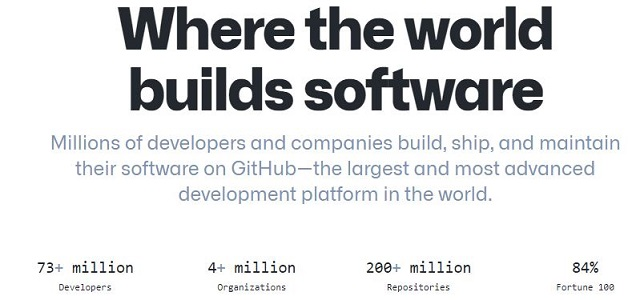
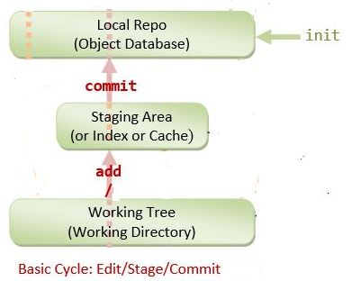
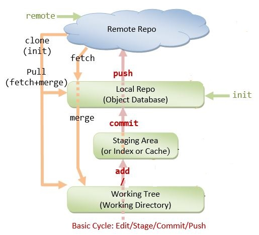
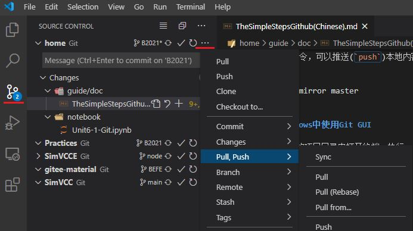

# 本地项目Git版本控制并同步到远程Github仓库的方法简介

## Git简介

 **Version Control System(VCS)** serves as a Repository (or repo) of program codes, including all the historical revisions. It records changes to files at so-called commits in a log so that you can recall any file at any commit point.

 **Why VCS?**

* The Repository serves as the **backup** (in case of code changes or disk crash).
* It is a living archive of all historical revisions. It lets you **revert** back to a specific version, if the need arises.
* It facilitates **collaboration** between team members, and serves as **a project management tool**

[Git](https://git-scm.com/) is a Distributed Version Control System (DVCS)

It was initially designed and developed by Linus Torvalds, in 2005, to support the development of the Linux kernel.

[GitHub](https://github.com/) is a code hosting platform for version control and collaboration. It lets you and others work together on projects from anywhere.



>**版本控制**: 指对软件开发过程中各种程序代码、配置文件及说明文档等文件**变更**的管理，是软件配置管理的核心思想之一
>
>**GitHub**: 一个面向开源及私有软件项目的托管平台，因为只支持Git作为唯一的版本库格式进行托管，故名GitHub。

<!-- TOC -->

- [本地项目Git版本控制并同步到远程Github仓库的方法简介](#本地项目git版本控制并同步到远程github仓库的方法简介)
  - [Git简介](#git简介)
  - [1 本地Git和远程Git版本控制的初始化](#1-本地git和远程git版本控制的初始化)
    - [1.1 本地安装Git、远程建立Git账户](#11-本地安装git远程建立git账户)
    - [1.2 配置Git本地用户名和email(和远程Git账户一致）](#12-配置git本地用户名和email和远程git账户一致)
  - [2  使用Git对本地项目进行版本控制](#2--使用git对本地项目进行版本控制)
    - [2.1  初始化本地项目的Git版本控制](#21--初始化本地项目的git版本控制)
    - [2.2 提交工作内容到Git仓库](#22-提交工作内容到git仓库)
      - [2.2.1 工作区内容提交到缓存区](#221-工作区内容提交到缓存区)
      - [2.2.2 存入缓存区的内容提交至本地仓库](#222-存入缓存区的内容提交至本地仓库)
  - [3 本地仓库的远程仓库初始化](#3-本地仓库的远程仓库初始化)
    - [3.1 在远程账户中建立一个和本地项目目录`同名`的空仓库](#31-在远程账户中建立一个和本地项目目录同名的空仓库)
    - [3.2 将远程仓库加为本地Git项目的远程源](#32-将远程仓库加为本地git项目的远程源)
    - [3.3 `首次` 推送本地仓库到远程git仓库](#33-首次-推送本地仓库到远程git仓库)
  - [4 本地仓库工作内容变化更新、同步到远程github](#4-本地仓库工作内容变化更新同步到远程github)
    - [4.1 本地工作内容变化提交到暂存区](#41-本地工作内容变化提交到暂存区)
    - [4.2 存入暂存区内容提交至本地仓库](#42-存入暂存区内容提交至本地仓库)
    - [4.3 本地仓库推送到远程git仓库](#43-本地仓库推送到远程git仓库)
    - [4.4 Git本地和远程仓库操作过程图](#44-git本地和远程仓库操作过程图)
  - [5 持久化远程Git账号](#5-持久化远程git账号)
  - [6 创建分支](#6-创建分支)
    - [6.1 本地新建分支](#61-本地新建分支)
    - [6.2 切换分支](#62-切换分支)
    - [6.3 新分支发布到远程Git仓库](#63-新分支发布到远程git仓库)
  - [7 删除分支](#7-删除分支)
    - [7.1 删除本地分支](#71-删除本地分支)
    - [7.2 删除远程Git仓库中的分支](#72-删除远程git仓库中的分支)
  - [8 使用远程仓库](#8-使用远程仓库)
    - [8.1 克隆远程仓库到本地](#81-克隆远程仓库到本地)
    - [8.2 获取远程更新](#82-获取远程更新)
  - [9 Git GUI客户端](#9-git-gui客户端)
    - [9.1 Version Control in VS Code](#91-version-control-in-vs-code)
    - [9.2 Git GUI](#92-git-gui)
  - [参考：](#参考)

<!-- /TOC -->

**初始环境**:一个没有使用版本控制的本地目录


**NOTE**: 所有Git命令都须在用Git进行版本控制项目的目录下，打开的终端中执行

* open the terminal from the project directory, then run the git command.

## 1 本地Git和远程Git版本控制的初始化

对项目工作目录进行本地Git和远程Git版本控制需要做的初始化工作，只需做一次。

### 1.1 本地安装Git、远程建立Git账户

### 1.2 配置Git本地用户名和email(和远程Git账户一致）

Every git user should first introduce himself to git, by running these two commands:

```bash
>git config --global user.name  yourname
>git config --global user.email youremail
```

## 2  使用Git对本地项目进行版本控制

### 2.1  初始化本地项目的Git版本控制

```bash
>git init
```

### 2.2 提交工作内容到Git仓库

#### 2.2.1 工作区内容提交到缓存区

```bash
>git add .
```

注意： add命令后面是：`空格` 加一个 `.`

#### 2.2.2 存入缓存区的内容提交至本地仓库

```bash
>git commit -m “your desc of the commit"
```
   

## 3 本地仓库的远程仓库初始化

### 3.1 在远程账户中建立一个和本地项目目录`同名`的空仓库

新建的Github仓库必须是 **空** 仓库，不能有README.md等任何内容

### 3.2 将远程仓库加为本地Git项目的远程源

在本地Git仓库所在目录下打开的终端中执行：

```bash
>git remote add origin https://gitee.com/your-username/your-reponame.git   
```

> `origin`: 指向远程仓库的`标签（名字）`

### 3.3 `首次` 推送本地仓库到远程git仓库 

在本地Git仓库所在目录下打开的终端中执行：

```bash
>git push -u origin master
```

> master: 在git仓库中创建的第一个branch

## 4 本地仓库工作内容变化更新、同步到远程github

在初始化了本地仓库的远程Github仓库后，本地Git仓库中的本地也 远程内容更新和同步工作如下：

### 4.1 本地工作内容变化提交到暂存区

```bash
>git add .
```

### 4.2 存入暂存区内容提交至本地仓库

```bash
>git commit -m “your desc of the commit"
```

### 4.3 本地仓库推送到远程git仓库

```bash
>git push
```

### 4.4 Git本地和远程仓库操作过程图 

   

## 5 持久化远程Git账号

本地全局存储持久化远程Git账号，解决每次链接到git远程仓库都必须输入用户名和密码登陆的问题

Windows下
```bash
>git config --global credential.helper wincred
```
Linux:
```
$git config --global credential.helper 'store --file ~/.mygit-credentials'
```

## 6 创建分支

设创建分支：branch1

### 6.1 本地新建分支 

```bash
>git branch branch1 
```

### 6.2 切换分支

```bash
>git checkout branch1
```

### 6.3 新分支发布到远程Git仓库

```bash
>git push origin branch1 
```

## 7 删除分支 

设删除分支：betaBranch1

### 7.1 删除本地分支 

```bash
>git branch -d branch1 
```

### 7.2 删除远程Git仓库中的分支

```bash
git push origin –delete branch1 
```

## 8 使用远程仓库

### 8.1 克隆远程仓库到本地

```bash
git clone repository
```

```
git clone https://gitee.com/thermalogic/SEES.git
```

### 8.2 获取远程更新

```bash
git pull
```

## 9 Git GUI客户端

### 9.1 Version Control in VS Code



### 9.2 Git GUI

在使用git的项目目录中打开终端，执行

```bash
>git gui
```

## 参考：

* [1] [Version Control with Git](https://swcarpentry.github.io/git-novice/)

* [2] [How to get started with GIT and work with GIT Remote Repo](https://www3.ntu.edu.sg/home/ehchua/programming/howto/Git_HowTo.html)

* [3] [Using Version Control in VS Code](https://code.visualstudio.com/docs/editor/versioncontrol)

