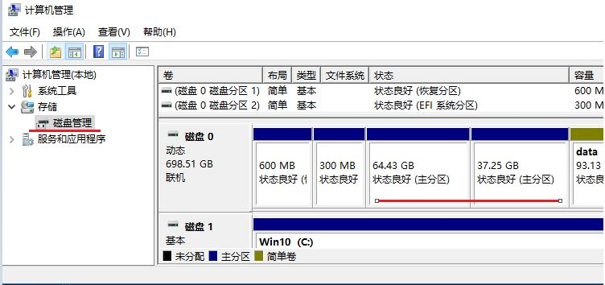
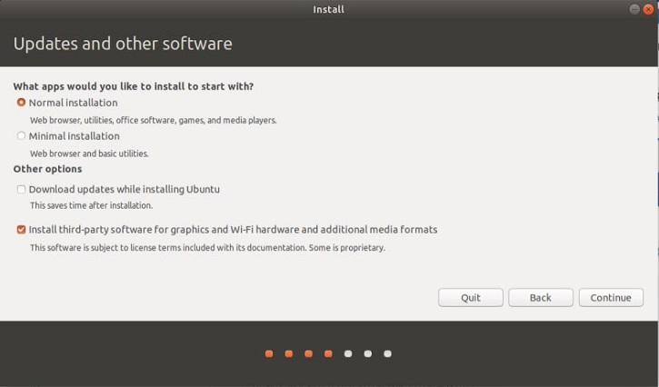
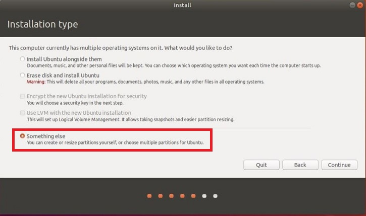

# Ubuntu系统安装和Python,C/C++开发环境的建立

在已安装Windows系统的电脑上，安装Ubuntu系统的过程简介

## 一、 准备安装Ubuntu系统需要的空闲硬盘空间

在Windows环境下，从`空余`的硬盘空间中划出一个`空的独立分区`，给Ubuntu使用。建议空间稍大些,以便作为正式的开发环境，如：100G。(基本安装10G也可以)



## 二、 准备Ubuntu安装U盘

* 从Ubuntu官网 https://www.ubuntu.com/download/desktop 下载**偶数年**的长期技术支持LTS版,如：Ubuntu 20.04.2 LTS

  Torrent下载： http://releases.ubuntu.com/20.04.2/ubuntu-20.04.2.0-desktop-amd64.iso.torrent

* 从 http://rufus.akeo.ie/  下载rufus，用rufus制作可启动的Ubuntu系统安装U盘

* 电脑启动时，通过BIOS/UFEI/(F12,F11 or F2 depending on your computer)，设置电脑从U盘启动，然后，安装Ubuntu

## 三、 安装Ubuntu

安装过程中的主要步骤如下：

### 3.1 基本项目

* 1 Welcome：选择语言 **English**

* 2 Wireless：选择 **不连接无线网络** 

* 3 updates and other software: 选择 **Install third-party software**

  

### 3.2 Installation 

* 4 Installation type（安装类型）

  选择 `something else` (注意：**务必** 选择安装类型 为 **`something else`**，以便自定义分区)

   

* 5 Create Partition（建立分区） 

   在 **`空闲空间（freespace)`** 中定义Ubuntu系统的分区(partition)和挂载点(Mount point)。

    * **注意**：一定要确定使用的是Windows的`空闲空间（freespace)`，不要破坏Windows系统及其用户使用的空间.

   Ubuntu系统的分区很多，快捷安装只需配置:
   
   *  `/home 分区和挂载点` 
   
   *  `/ 系统分区和挂载点`
   
   其他由系统自动配置。

  **`/home` 分区和挂载点**：从**空闲空间**中划出一个分区作为 `/home` 挂载点。
  
     * 一定要有**home**挂载点和分区。如重新安装ubuntu， 仍将这个分区挂载在home下，不要格式化该分区，这样原系统中的用户文件都能保留 

     

  **`/` 系统分区和挂载点**：将余下空闲空间都划给`“/”` 分区，作为系统挂载点。 如果重新安装其他版本Linux，可将这个分区格式化.

   &emsp; &emsp;

  定义好`/SEES 分区和挂载点` 和 `/ 系统分区和挂载点` 后，可见分区情况：

   &emsp; &emsp;

* 6  Installing 

  点 `Install Now` 前，务必再次确认使用的是 `空闲空间（freespace)`及分区的配置信息正确，不要破坏Windows系统及其用户使用的空间。

  确认分区无误后，点`Install Now`,进入以下步骤：

* 7 Where are you: 选择时区为 **shanghai**

* 8  Who are you: 给出用户名和密码，选择自动登录（为方便使用，**名字和密码宜简短**）

   * 如是重装Ubuntu系统且要使用 **`原home`分区**, 用 **`原用户名`** 

  安装程序将从U盘安装Ubuntu到指定的硬盘分区中。安装过程需要些时间，耐心等待即可。

### 3.3 更新系统和镜像软件源

系统安装后，移除U盘，重新启动系统，配置电脑连接Internet, 然后，打开终端（Ctrl+Alt+T), 执行以下命令，更新软件源和系统软件

```bash 
$sudo apt update
$sudo apt upgrade
```

Ubuntu的默认软件源可能速度较慢，需要改为更快的 **`镜像软件源`**：

* 点击桌面任务栏中的:

  `Show Application`

* 点击

  `Software & Updates`
 
   在其`Download from` 镜像源列表中,选择速度快的镜像源，如华为云镜像。
 
   点击`Close`后，系统自动更新。

  


### 3.4 修正Ubuntu和Windows时间的不一致

Windows和Linux对硬件标准时间的设置不同，Windows默认为当地时间，而Linux默认为UTC时间，会差8小时.

执行以下命令，设定Ubuntu使用当地时间
```bash
$sudo timedatectl set-local-rtc 1 
```

以上是安装过程的要点步骤，详细的安装过程搜索网络。

进一步安装工作需要的软件，并对系统桌面做个性化配置。

&emsp;&emsp;

>
>建议可选Ubuntu发行版：
>
>* “中国味”的UbuntuKylin: http://www.ubuntukylin.com/.  UbuntuKylin默认支持中文，预安装有WPS，搜狗拼音输入法等


## 四、开发环境

### 4.1 Version Control: Git

```bash 
$sudo apt install git
```

### 4.2 GCC编译器

Ubuntu内置GCC编译器，无需安装.

部分Debian/Ubuntu发行版缺少GCC开发支持包，需补充安装：

The command installs a bunch of new packages including gcc, g++ and make.

```bash 
$sudo apt install build-essential
```

`gcc-multilib` is useful for cross-compiling, that is, compiling a program to run on a different processor architecture.

```bash 
$sudo apt install  gcc-multilib  g++-multilib
```
### 4.3 Python3 and Tools

Ubuntu内置Python3解释器. 但不完整，需补充包安装工具: pip3

```bash
$sudo apt install python3-pip
$sudo -H python3 -m  pip install -i https://pypi.tuna.tsinghua.edu.cn/simple pip -U
```
目前，Ubuntu系统中同时有Python2和Python3两个版本的解释器。Python3版本的相关命令都加3，如：

```bash
$python3 
$pip3
```
### 4.4 Analytics & Scientific Computing Python Packages

Installing from Ubuntu Software Sources

```bash
$sudo apt install python3-numpy python3-scipy python3-matplotlib
```
### 4.5 Installing Python Packages from Pypi

#### 4.5.1 set `tsinghua` as the mirror site of Pypi

```bash
$sudo -H python3 -m pip config set global.index-url https://pypi.tuna.tsinghua.edu.cn/simple
```
#### 4.5.2 Installing Packages

```bash
$sudo -H python3 -m pip install jupyter 
```

```bash
$sudo -H  python3 -m pip install coolprop 
```

### 4.6 Visual Studio Code

#### 4.6.1 Installing Visual Studio Code

From  https://code.visualstudio.com/docs/?dv=linux64_deb  download VS Code for Debian/Ubuntu,the install in the terminal

```bash
$sudo dpkg -i [vscode filename].deb
```

#### 4.6.2 Installing  Extensions

Install Python Extension in  Visual Studio Code

* https://code.visualstudio.com/docs/languages/python

Install the Microsoft C/C++ extension

* https://code.visualstudio.com/docs/languages/cpp

#### 4.6.3 Set Python3 as the default Python Version

```json
// Path to Python, you can use a custom version of Python by modifying this setting to include the full path.
  "python.pythonPath": "python3",
```

### 4.7 Installing GSL

```bash
$sudo apt install gsl-bin
$sudo apt install libgsl-dev
```
### 4.8 Installing Gnuplot

```bash
$sudo apt install gnuplot
```

## 五、英文版Ubuntu补充中文支持

为Ubuntu补充中文支持的基本环节如下：

1. 安装中文语言支持包：`Language Support`-->`Install`

2. 安装中文输入法，建议使用**搜狗拼音输入法** 

3. 配置搜狗拼音输入法为系统中文输入方法

不同的Ubuntu发行版的安装方法会有差别，可上网查询。

通常的步骤是:

从 https://pinyin.sogou.com/linux/ 下载**搜狗拼音输入法**的deb安装包，然后：

```bash
$sudo dpkg -i sogoupinyin_filename.deb
```

安装时，如果提示缺少依赖，执行
```bash
$sudo apt -f install
```

然后，再次

```bash
$sudo dpkg -i sogoupinyin_filename.deb
```

安装后logout当前用户，再login，输入法就安装好了。Ctrl+Blank Space 可以切换中/英文输入法

## 六、 英文版补充WPS Office软件

Ubuntu中内置有Libreoffice,但其和Microsoft Office的兼容性一般。

如果需要处理Microsoft Office文档，可以安装WPS Office For Linux(Microsoft Office兼容性好的Linux办公软件）

从 https://www.wps.cn/product/wpslinux/ 下载最新版的WPS，打开终端安装

```bash
$sudo dpkg -i wps-office_*_amd64.deb 
```

安装时，如果提示缺少依赖，执行

```bash
$sudo apt -f install
```

英文版的Ubuntu中运行WPS Office For Linux时，会提示缺失一些字体。解决方案可网上查询

安装WPS Office For Linux后，可以删除libreoffice。终端执行命令

```bash
$sudo apt-get remove --purge libreoffice*
```

## 七、修改grub启动顺序

安装了双系统的计算机启动时有启动菜单，供用户选择启动那个系统。默认是菜单中的第一个项目：Ubuntu系统。 

如果需默认启动Windows，可以修改grub启动配置文件。

用下面的命令打开grub启动配置文件

```bash
$sudo gedit  /etc/default/grub
```
GRUB启动项是按照启动菜单依次使用数字进行索引了，起始数字为0。
文件中的`GRUB_DEFAULT=0`就是设置的默认启动项。

如果Windows启动项在第3项，就需要修改为2（因为第一项是从0开始的）。修改完成，保存退出。

然后，执行如下命令，重新生成GRUB启动配置项
```bash
$sudo update-grub
```

## 八、修正一些异常

### 8.1 Windows 10 does not show up in the GRUB Boot menu after installing Ubuntu

Boot into Ubuntu. Start a terminal and issue these commands:

```bash
$sudo update-grub
$sudo grub-install /dev/[Windows Boot partition e.g., sda1]
```

* The first command could fix the problem. 

* The second command is used to manually add Windows partition into the GRUB boot menu.

## 参考

* How to install and Get Started with Ubuntu Desktop http://www3.ntu.edu.sg/home/ehchua/programming/howto/Ubuntu_HowTo.html

* Programmer's Survival Guide for Mac & Ubuntu  http://www3.ntu.edu.sg/home/ehchua/programming/howto/Unix_SurvivalGuide.html

* 优麒麟20.04(UbuntuKylin)简易安装手册 https://www.ubuntukylin.com/public/pdf/2004.pdff
