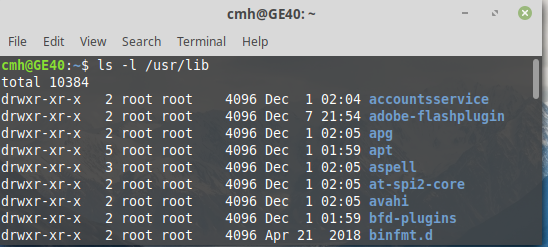
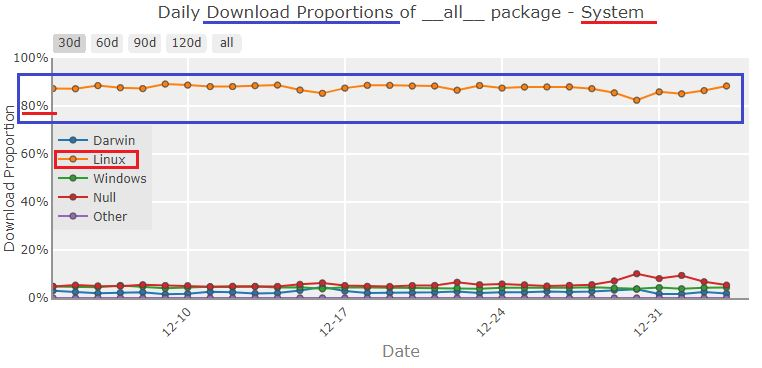
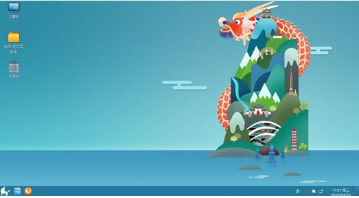
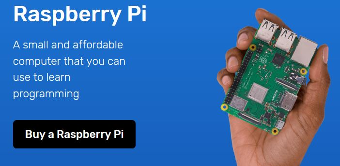
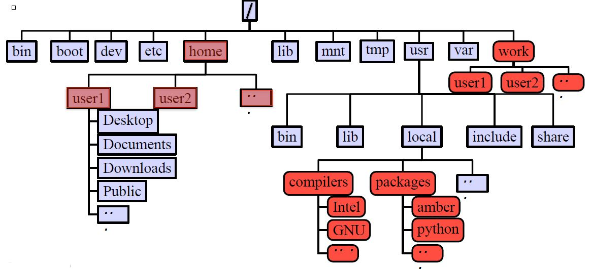
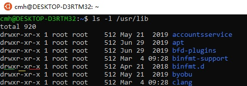
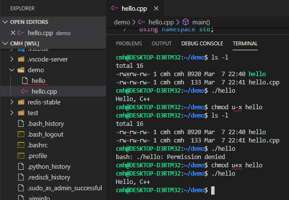

#  Linux/Ubuntu

## 1 What is Linux

### 1.1 History of Linux

**Unix** was initially designed and implemented at **AT&T Bell Labs** 1969 by Ken Thompson, Dennis Ritchie, Douglas McIlroy, and
Joe Ossanna

* First released in 1971 and was written in assembly language

* Re-written in C by Dennis Ritchie in 1973 for better portability (with exceptions to the kernel and I/O)

**Linux Kernel**: [Linus Torvalds](https://baike.baidu.com/item/林纳斯·本纳第克特·托瓦兹/1034429?fromtitle=Linus%20Torvalds&fromid=9336769&fr=aladdin), a student at University of Helsinki began working on his own operating system, which became the "Linux Kernel", 1991

* Linus released his `kernel` for `free download` and helped further developmen

   * Linux as the kernel only, applications on top of the kernel were still missing

**Linux System**: Linux kernel + `software`

* `GNU/Linux(Linux)`: Linux kernel + software from the GNU project released under the `GNU Public License (GPL)`: **Free to use**,

   * The GNU Project by Richard Stallman started in 1983 Creating a “complete Unix-compatible software system” with entirely free software

<b style="color:blue">Linux is everywhere</b>

It appears in many different architectures, from mainframes to `server` to `desktop` to `mobile` and on a staggeringly `wide variety of hardware`.

* **Linux** powers 100% of the world’s **supercomputers**, 

* most of the **servers** powering the Internet, the majority of financial trades worldwide  

* over two billion **Android** devices. 
  
### 1.2  What is a Kernel

The core component of an OS

* Manage the system’s resources, memory, file systems

* Provide the lowest level abstraction layer to upper layer components

* Inter-process communications and system calls are used to make services available

###  1.3  What is a Shell

An application software running `on top of the kernel` and provides a powerful **interface** to the `system`

Process user’s commands, gather input from user and execute programs

`Types of shell` with varied features

  * sh ： Bourne shell

  * csh ： C shell

  * ksh： Korn shell

  * `bash` Bourne Again shell
 
The simple **bash** command

```
$ls -l /usr/lib
```



## 2 Linux Distributions

* **Essential components**: Linux kernel + GNU system utilities + installation scripts + management utilities etc.

* Many software vendors release their own packages, known as `distributions`

  * Debian,  [Ubuntu](https://www.ubuntu.com/), Linux Mint,[Ubuntukylin](http://www.ubuntukylin.com/)
  
  * Red Hat, [Fedora](https://getfedora.org/en/), CentOS

  * Slackware, [OpenSUSE](https://www.opensuse.org/)

  * archlinux https://www.archlinux.org/

  * Gentoo
  
  * **Mobile** OS: [Android](https://en.wikipedia.org/wiki/Android_(operating_system))(Google),[Tizen](https://www.tizen.org/)(The Linux Foundation)

**[DistroWatch](https://distrowatch.com/)**

DistroWatch is a website dedicated to talking about, reviewing and keeping up to date with open source operating systems. 

This site particularly focuses on `Linux distributions` and flavours of BSD, though other open source operating systems are sometimes discussed.

## 3 Desktop Environment

Linux distributions offer a variety of **`desktop environment`**：

**GNOME,KDE,MATE,Xfce**

*  MATE and Xfce are the more lightweight desktop environments.


## 4  Linux is important for engineer and scientist

Download stats across **all packages** on PyPI: 

https://pypistats.org/packages/__all__

The download proportion of **Linux >80%**



Let us to get the PyPI downloads by operating system  of packages with `pypistats`  

```
>python -m pip install pypistats
```
```
>pypistats system  package-name
```
>Note:`null` value is generated by `monitoring tools` and should not be counted as user's downloads. 

**The PyPI downloads by operating system of SciPy packages**：


```python
!pypistats system numpy
```

    | category | percent | downloads  |
    |----------|--------:|-----------:|
    | Linux    |  80.98% | 77,429,700 |
    | Darwin   |   7.38% |  7,052,768 |
    | null     |   5.92% |  5,659,883 |
    | Windows  |   5.71% |  5,459,250 |
    | other    |   0.01% |     14,109 |
    | Total    |         | 95,615,710 |
    
    


```python
!pypistats system scipy
```


```python
!pypistats system matplotlib
```

**The PyPI downloads by operating system of IAPWS packages**:


```python
!pypistats system iapws
```


```python
!pypistats system seuif97
```

The **maximum** proportion of the operating system is **Linux.** 

The **proportion** of using Linux operating system( <b style="color:blue">>70%</b>) was **higher than** Windows and others.

**Linux is important for engineer and scientist!**

## 5 Ubuntu

[Ubuntu](https://www.ubuntu.com/) is a free and open-source operating system and [Linux](https://en.wikipedia.org/wiki/Linux) distribution based on [Debian](https://www.debian.org/). Ubuntu is offered in three official editions:  <b style="color:blue">Ubuntu Desktop</b> for personal computers,  <b style="color:blue">Ubuntu Server</b> for servers and the cloud, and  <b style="color:blue">Ubuntu Core</b> for Internet of things devices and robots.

Ubuntu is produced by **Canonical** and the developer community, under a meritocratic governance model.

Ubuntu is named after the Southern African philosophy of ubuntu (literally, 'human-ness'), which Canonical suggests can be loosely translated as "humanity to others" or "I am what I am because of who we all are"
    
* **New releases** of Ubuntu occur every **6** months. 


* The **long-term support (LTS)** releases occur every **2**

  * The most recent LTS is `18.04 LTS (Bionic Beaver)`,supported for ten years. 


[优麒麟（Ubuntu Kylin）](http://www.ubuntukylin.com/)

由中国 CCN（由CSIP、Canonical、NUDT三方联合组建）开源创新联合实验室与天津麒麟信息技术有限公司主导开发的全球开源项目，其宗旨是通过研发用户友好的桌面环境以及特定需求的应用软件，为全球 Linux 桌面用户带来非凡的全新体验！
优麒麟操作系统是 Ubuntu 官方衍生版，得到来自 Debian、Ubuntu、Mate、LUPA 等国际社区及众多国内外社区爱好者的广泛参与和热情支持

[银河麒麟](http://www.kylinos.cn/) 

银河麒麟操作系统及相关衍生产品已成功应用于国防、政务、电力、金融、能源、教育等行业，基于银河麒麟操作系统和飞腾CPU的自主可控产品及方案已经成为我国自主安全可控信息系统的核心技术应用。




[Raspberry Pi](https://www.raspberrypi.org/)

Our mission is to put the power of computing and digital making into the hands of people all over the world. We do this so that more people are able to harness the power of computing and digital technologies for work, to solve problems that matter to them, and to express themselves creatively.

**Raspbian** is our official operating system for all models of the Raspberry Pi. Download it here, or use NOOBS, our easy installer for Raspbian and more.




**Ubuntu on Windows**

you may install `Ubuntu on Windows` through `Windows Store` to use Ubuntu Terminal and run Ubuntu command line utilities include `bash,ssh,git,apt and any more`.


## 6 Using Terminal

Programmers use **"Terminal"** to issue commands, instead of the graphical user interface

To launch a Terminal in Debian/Ubuntu:

* Press `Ctrl+Alt+T`

* `Right-click` inside a folder/desktop, then,click `open a terminal`

A Terminal displays a command prompt ending with a `"$"` sign, in the form of:

`"Username@ComputerName:CurrentDirectory$"`

You can enter commands after the command prompt. For example, enter "`ls`" to list the contents of the current working directory, e.g.,

```bash
<prompt>$ls
```

## 7 Linux File System


### 7.1 Files

A simple description of the UNIX system, also applicable to Linux, is this:

* **"On a UNIX system, everything is a file; if something is not a file, it is a process."**

**Sorts of files** 

Most files are just files, called **regular files**(普通文件）; they contain normal data, for example text files, executable files or programs, input for or output from a program and so on.

While it is reasonably safe to suppose that **everything you encounter on a Linux system is a file**, there are some exceptions.

* **Directories** files that are lists of other files.

* **Special** files: the mechanism used for input and output. Most special files are in `/dev`

* **Links** : a system to make a file or directory visible in multiple parts of the system's file tree. 

* **(Domain) sockets**: a special file type, similar to TCP/IP sockets, providing inter-process networking protected by the file system's access control.

* **Named pipes:** act more or less like sockets and form a way for processes to communicate with each other, without using network socket semantics.


### 7.2 File Directory Structure

* All`files` are arranged in `directories`.

* These `directores` are organized into the `file system`




**Important Directories**


* /bin:  contains files that are essential for system operation, available for use by all
users.

* /lib,/lib64: contains libraries that are essential for system operation, available for use by
all users.

* /var:  used to store files which change frequently (system level not user level)

* /etc:  contains various system configurations


* **/dev**:  contains various **devices** such as hard disk, CD-ROM drive etc(**In Linux, everything is a file**)


* /sbin:  same as bin but only accessible by root

* /tmp:  temporary file storage


* **/boot**: contains `bootable kernel and bootloader`


* **/usr:**  contains user documentations, binaries, libraries etc


* **/home:**  contains home directories of **all users**. 

  * This is the directory where you are at when you login to a Linux/UNIX system.


### 7.3 File Path

File Path(Definition): position/address in the `directory tree`

**Absolute path**

`Uniquely` defined and does **NOT depend on the current path**

**Relative path**

**Depend on the current location** in the directory tree

*  . is the current working directory

* .. is one directory up


### 7.4 Linux is Case Sensitive

All names are **case sensitive**

*  Commands, variables, files etc.

Example: `MyFile.txt, myfile.txt, MYFILE.TXT` are three different files in Linux


### 7.5 Linux File Permission

Designed as the multi **user** environment, the **access restriction** of files to other users on the system is embedded.

Three types of **file permission**

* Read (r)

* Write (w)

* Execute (x)

Three types of **user**

* User (u) (owner)

* Group (g) (group members)

* World (o) (everyone else on the system)

Each file in Linux has the following attributes:

* `Owner permissions`: determine what actions the owner of the file can perform on a file

* `Group permissions`: determine what actions a user, who is a member of the group that a file belongs to, can perform on a file

* `Other(world) permissions`: indicate what action all other users can perform on a file


The `-l`option to **ls** displays the file type,using the **first column** indicates the type of a **file/dir/link**

* `d`: for directory

* `l`: for `symbolic link`(符号链接(软链接):将路径名链接到一个文件)

* `-` for normal file

> **A symbolic link** is a `file` that links to another file or directory using its path. you can think of a symbolic link as `a shortcut` to a file or directory (folder). symbolic links may be used in the command line, or in a script or another program.



### 7.6 Changing File Permission

**chmod** is a *NIX command to change permissions on a file

Usage: 
```bash
chmod <option> <permissions> <file or directory name>
```
* –R: change permission recursively in a directory(all files in a  directory)

**chmod in Symbolic Mode:**

|Chmod| operator Description|
|:-------:|:--------:|
|+ |Adds the designated permission(s) to a file or directory|
|- |Removes the designated permission(s) from a file or directory|
|= |Sets the designated permission(s) and removes other permission(s|

```bash
chmod u-x filename
```



## 8  Applications and Utilities

* **LibreOffice**: The default Ubuntu's productivity suite, which is a variant of OpenOffice (currently owned by Apache). It includes:
  
  * Writer: word processor, similar to Microsoft Word.
  * Calc: spreadsheet, similar to Microsoft Excel.
  * Impresss: Presentation program, similar to Microsoft Powerpoint.
  * Math: Math formula editor.
  * Draw: Graphics application for creating images.
  * Base: Database application, similar to Microsoft Access.

* **Dia**: Technical diagram drawing editor, similar to Microsoft Visio.

* **gedit** Text Editor: The GNU gedit is the default text editor in Ubuntu. [TODO] more.

* **Screenshot**: Press `PrintScreen` key to capture the entire screen; `alt+PrintScreen` key to capture the current window. The images are captured in PNG. Alternatively, use the dash to search for `"Screenshot"`. You can set the area of screenshot.

* **PDF Documents**: Evince is the default PDF reader (you can also install the Acrobat Reader). To edit PDF document, you can install an extension called PDF Import to LibreOffice, or use programs such as PDF Editor (pdfedit).
    

## 9 APT for Managing Software

Ubuntu adopts Debian's **Advanced Packaging Tool (APT)** for software package management of `".deb"` package.

>Other Linux distros, such as Red Hat, uses RPM Package Manager.

APT can properly handle the dependencies. It automatically finds and downloads all the dependencies of the packages to be installed. It can also resume installation after an interruption.

The  apt includes sub-commands such as `list, search, show, update, install, remove, upgrade, full-upgrade, edit-source`.

### 9.1  Software sources
 
`APT` keeps a list of software sources on your computer in a file at `/etc/apt/sources.list`.

Before installing software, you **should update your package list** with apt update:

```
sudo apt update
```

### 9.2 Installing a package with APT

Installing a package with APT

```
sudo apt install git
```

### 9.3 Uninstalling a package with APT

* Remove

  You can uninstall a package with `apt remove`:
```
sudo apt remove git
```

* Purge

  You can also choose to `completely remove the package and its associated configuration files` with `apt purge`
```
sudo apt purge git
```

### 9.4 Upgrading existing software

If software updates are available, you can get the updates with 

```
sudo apt update 
```

install the updates with 

```
sudo apt upgrade
```

which will upgrade all of your packages.

To upgrade a `specific` package, without upgrading all the other out-of-date packages at the same time, you can use 
```
sudo apt install somepackage
```
which may be useful if you're low on disk space or you have limited download bandwidth.

### 9.5 Searching for software
You can search the archives for a package with a given keyword with `apt search`

```
apt search python3-pip
```
You can view more information about a package before installing it with  `apt show`

```
apt show  python3-pip
```

###  9.6 Installing a package with dpkg

* `dpkg:` The dpkg (Debian Package Manager) is the low level tool for installing, removing and providing information about '.deb' packages.

```bash
sudo dpkg -i vscode_filename.deb
```

## 10 Programming C/C++ Under Linux


* [Unit8-1-GCC_Lib](./Unit8-1-GCC_Lib.ipynb)


## 11 Installing Ubuntu for Programming with Python,C/C++

https://github.com/PySEE/home/blob/S2020/guide/doc/Ubuntu-Python-CPP(Chinese).md

# Reference

* [How to install and Get Started with Ubuntu Desktop 16.04LTS](http://www3.ntu.edu.sg/home/ehchua/programming/howto/Ubuntu_HowTo.html)

* edX: Introduction to Linux https://www.edx.org/course/introduction-to-linux

* Ubuntu https://www.ubuntu.com/

  * Ubuntukylin https://www.ubuntukylin.com/


```python

```
