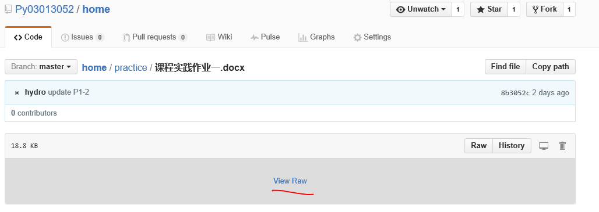

  
# Practice

 <h2>行是知之始，知是行之成    - 陶行知 </h2>
 
 课程实践作业：
 
 　　涵盖Python程序设计、代码规范、软件测试、任务管理、文档撰写和英文资源使用等能力训练；
 
 　　涉及数据分析、交互计算、社区编程等科学计算和软件开发模式。
 
 <ol>
 <li>软件开发基础：Python开发环境建立  
 
 <li>版本管理及团队编程1：建立Github账户、基本操作、加入社区编程组等，  
 
 <li>版本管理及团队编程2：Git、Github、EGit等 
 
 Ref: Maximilian Koegel,Jonas Helming. EGit Toturial http://eclipsesource.com/blogs/tutorials/egit-tutorial/. 2015.02
  
 <li>英文阅读：翻译Guttag, John教程中的6.2.3和6.2.4 
  
 <li>网络资源：使用Stackoverflow.com  
 
 <li>数据分析：统计、回归及可视化
 
 <li>单元测试：测试对象为“基于IAPWS-IF97的水和水蒸汽物性计算软件包” 
       
 <li>应用实践：3个专业相关问题求解程序设计，含代码规范、软件测试、任务管理、交互计算及文档撰写等  
 </ol>

## 下载docx文档

1. 下载整个home仓库的zip文件，解压
         
          进入home仓库后，点“Download ZIP",如下图

   
   
   下载整个home仓库的zip文件，解压

2. 在home仓库中当前目录中下载
  
         在home仓库中当前目录\parctice下，点击文档后，稍等，点下图中的”viewraw",提示下载时，进行下载
 
        如果安装有迅雷，会启动迅雷下载
 
  

